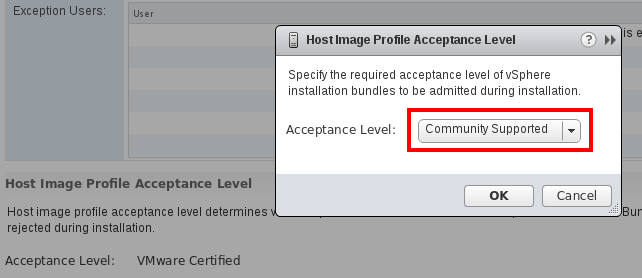
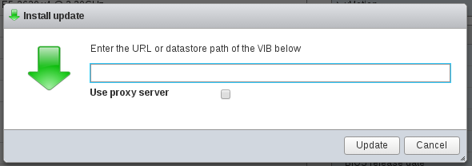
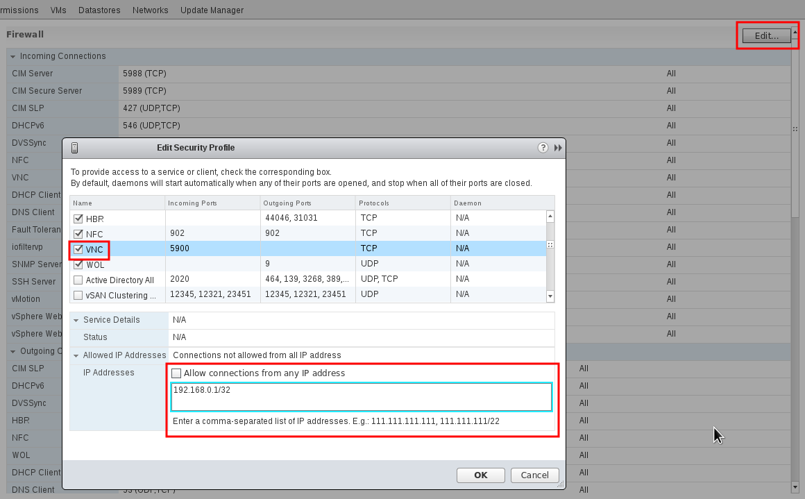

.. _vcenter_node:

================================================================================
vCenter Node Installation
================================================================================

This Section lays out the requirements configuration needed in the vCenter and ESX instances in order to be managed by OpenNebula.

The VMware vCenter drivers enable OpenNebula to access one or more vCenter servers that manages one or more ESX Clusters. Each ESX Cluster is presented in OpenNebula as an aggregated hypervisor, i.e. as an OpenNebula Host. This means that the representation is one OpenNebula Host per ESX Cluster.

Note that OpenNebula scheduling decisions are therefore made at ESX Cluster level, vCenter then uses the DRS component to select the actual ESX host and Datastore to deploy the Virtual Machine.

Requirements
================================================================================

The following must be met for a functional vCenter environment:

* vCenter 5.5, 6.0 and/or 6.5, with at least one cluster aggregating at least one ESX 5.5, 6.0 and/or 6.5 host.
* Define a vCenter user for OpenNebula. This vCenter user (let's call her ``oneadmin``) needs to have access to the ESX clusters that OpenNebula will manage. In order to avoid problems, the hassle free approach is to **declare this oneadmin user as Administrator**. Alternatively, in some enterprise environments declaring the user as Administrator is not allowed, in that case, you will need to grant permissions to perform some tasks. A table with the permissions requires is found at the end of this chapter.
* All ESX hosts belonging to the same ESX cluster to be exposed to OpenNebula **must** share at least one datastore among them.
* The ESX cluster **should** have DRS enabled. DRS is not required but it is recommended. OpenNebula does not schedule to the granularity of ESX hosts, DRS is needed to select the actual ESX host within the cluster, otherwise the VM will be launched in the ESX where the VM template has been created.
* If virtual standard switches are used, check that those switches exist in every ESX hosts belonging to the same ESX cluster, so the network represented by a port group can be used by a VM, no matter in what ESX host it's running. If you use distributed virtual switches, check that ESX hosts have been added to switches.
* To enable VNC functionality, please check the detailed information in section `VNC on ESX hosts`_ below.

.. important:: OpenNebula will **NOT** modify any vCenter configuration with some exceptions, the creation of virtual switches and port groups if the vcenter network driver is used and the creation of images for VMDK and/or ISO files.

.. note:: For security reasons, you may define different users to access different ESX Clusters. A different user can be defined in OpenNebula per ESX cluster, which is encapsulated in OpenNebula as an OpenNebula host.

Configuration
================================================================================

There are a few simple steps needed to configure OpenNebula so it can interact with vCenter:

Step 1: Check connectivity
--------------------------------------------------------------------------------

The OpenNebula Front-end needs network connectivity to all the vCenters that it is supposed to manage.

Additionally, to enable VNC access to the spawned Virtual Machines, the Front-end also needs network connectivity to all the ESX hosts

.. warning:: OpenNebula uses port 443 to communicate with vCenter instances. Port 443 is the default port used by vCenter so unless you're filtering that port or you've configured a different port to listen for connections from the vSphere Web Client, OpenNebula will be able to connect with the right credentials.

Step 2: Configure the drivers in the Front-end (oned.conf) [Optional]
--------------------------------------------------------------------------------

The following sections in the ``/etc/one/oned.conf`` file describe the information and virutalization drivers for vCenter, which are enabled by default:

.. code::

    #-------------------------------------------------------------------------------
    #  vCenter Information Driver Manager Configuration
    #    -r number of retries when monitoring a host
    #    -t number of threads, i.e. number of hosts monitored at the same time
    #-------------------------------------------------------------------------------
    IM_MAD = [
        NAME          = "vcenter",
        SUNSTONE_NAME = "VMWare vCenter",
        EXECUTABLE    = "one_im_sh",
        ARGUMENTS     = "-c -t 15 -r 0 vcenter" ]
    #-------------------------------------------------------------------------------

    #-------------------------------------------------------------------------------
    #  vCenter Virtualization Driver Manager Configuration
    #    -r number of retries when monitoring a host
    #    -t number of threads, i.e. number of hosts monitored at the same time
    #    -p more than one action per host in parallel, needs support from hypervisor
    #    -s <shell> to execute commands, bash by default
    #    -d default snapshot strategy. It can be either 'detach' or 'suspend'. It
    #       defaults to 'suspend'.
    #-------------------------------------------------------------------------------
    VM_MAD = [
        NAME          = "vcenter",
        SUNSTONE_NAME = "VMWare vCenter",
        EXECUTABLE    = "one_vmm_sh",
        ARGUMENTS     = "-p -t 15 -r 0 vcenter -s sh",
        default       = "vmm_exec/vmm_exec_vcenter.conf",
        TYPE          = "xml",
        IMPORTED_VMS_ACTIONS = "terminate, terminate-hard, hold, release, suspend,
            resume, delete, reboot, reboot-hard, resched, unresched, poweroff,
            poweroff-hard, disk-attach, disk-detach, nic-attach, nic-detach,
            snap-create, snap-delete"
    ]
    #-------------------------------------------------------------------------------

As a Virtualization driver, the vCenter driver accept a series of parameters that control their execution. The parameters allowed are:

+----------------+-------------------------------------------------------------------+
| parameter      | description                                                       |
+================+===================================================================+
| -r <num>       | number of retries when executing an action                        |
+----------------+-------------------------------------------------------------------+
| -t <num        | number of threads, i.e. number of actions done at the same time   |
+----------------+-------------------------------------------------------------------+

See the :ref:`Virtual Machine drivers reference <devel-vmm>` for more information about these parameters, and how to customize and extend the drivers.

Additionally some behavior of the vCenter driver can be configured in the ``/var/lib/one/remotes/etc/vmm/vcenter/vcenterc``. The parameters that can be changed here are as follows:

+----------------+-------------------------------------------------------------------+
| parameter      | description                                                       |
+================+===================================================================+
| :delete_images | Yes : You can delete the images using OpenNebula.                 |
|                | No  : VCENTER_IMPORTED attribute will be set on imported images.  |
|                | This attribute prevents the image to be deleted.                  | 
+----------------+-------------------------------------------------------------------+

OpenNebula needs to be restarted after any change in the ``/etc/one/oned.conf`` file, this can be done with the following command:

.. prompt:: bash $ auto

    $ sudo systemctl restart opennebula

.. _vcenter_import_host_tool:

Step 3: Importing vCenter Clusters
--------------------------------------------------------------------------------

OpenNebula ships with a powerful CLI tool to import vCenter clusters, VM Templates, Networks and running VMs. The tool **onevcenter** is self-explanatory, just set the credentials and FQDN/IP to access the vCenter host and follow on screen instructions.

If you need to know how to import vCenter clusters, check :ref:`vCenter import tool <vcenter_import_clusters>`.

Once the vCenter cluster is monitored successfully ON will show as the host status. If ERROR is shown please check connectivity and have a look to the /var/log/one/oned.log file in order to find out the possible cause.

The following variables are added to OpenNebula hosts representing ESX clusters:

+---------------------+------------------------------------+
|    Operation        |                Note                |
+---------------------+------------------------------------+
| VCENTER_HOST        | hostname or IP of the vCenter host |
+---------------------+------------------------------------+
| VCENTER_USER        | Name of the vCenter user           |
+---------------------+------------------------------------+
| VCENTER_PASSWORD    | Password of the vCenter user       |
+---------------------+------------------------------------+
| VCENTER_VERSION     | The vcenter version detected by    |
|                     | OpenNebula e.g 5.5                 |
+---------------------+------------------------------------+
| VCENTER_CCR_REF     | The Managed Object Reference to    |
|                     | the vCenter cluster                |
+---------------------+------------------------------------+
| VCENTER_INSTANCE_ID | The vCenter instance UUID          |
|                     | identifier                         |
+---------------------+------------------------------------+

.. note::

   OpenNebula will create a special key at boot time and save it in ``/var/lib/one/.one/one_key``. This key will be used as a private key to encrypt and decrypt all the passwords for all the vCenters that OpenNebula can access. Thus, the password shown in the OpenNebula host representing the vCenter is the original password encrypted with this special key.

.. note::

   You have more information about what is a Managed Object Reference and what is the vCenter instance UUID in the :ref:`vCenter driver<vcenter_managed_object_reference>` section.

Step 4: Next Steps
--------------------------------------------------------------------------------

Jump to the :ref:`Verify your Installation <vcenter_based_cloud_verification>` section in order to launch a VM or learn how to setup the :ref:`VMWare infrastructure <vmware_infrastructure_setup_overview>`.

Permissions requirement
================================================================================

If the user account that is going to be used in vCenter operations is not declared as an Administrator the following table summarizes the privileges required by the tasks performed in vCenter by OpenNebula:

+---------------------------------------------+----------------------------------------------------------------------------+
|                  Privileges                 |                       Notes                                                |
+---------------------------------------------+----------------------------------------------------------------------------+
| VirtualMachine.Interact.DeviceConnection    | Required by a virtual machine reconfigure action                           |
+---------------------------------------------+----------------------------------------------------------------------------+
| VirtualMachine.Interact.SetCDMedia          | Required by a virtual machine reconfigure action                           |
+---------------------------------------------+----------------------------------------------------------------------------+
| VirtualMachine.Interact.SetFloppyMedia      | Required by a virtual machine reconfigure action                           |
+---------------------------------------------+----------------------------------------------------------------------------+
| VirtualMachine.Config.Rename                | Required by a virtual machine reconfigure action                           |
+---------------------------------------------+----------------------------------------------------------------------------+
| VirtualMachine.Config.Annotation            | Required by a virtual machine reconfigure action                           |
+---------------------------------------------+----------------------------------------------------------------------------+
| VirtualMachine.Config.AddExistingDisk       | Required by a virtual machine reconfigure action                           |
+---------------------------------------------+----------------------------------------------------------------------------+
| VirtualMachine.Config.AddNewDisk            | Required by a virtual machine reconfigure action                           |
+---------------------------------------------+----------------------------------------------------------------------------+
| VirtualMachine.Config.RemoveDisk            | Required by a virtual machine reconfigure action                           |
+---------------------------------------------+----------------------------------------------------------------------------+
| VirtualMachine.Config.CPUCount              | Required by a virtual machine reconfigure action                           |
+---------------------------------------------+----------------------------------------------------------------------------+
| VirtualMachine.Config.Memory                | Required by a virtual machine reconfigure action                           |
+---------------------------------------------+----------------------------------------------------------------------------+
| VirtualMachine.Config.RawDevice             | Required by a virtual machine reconfigure action                           |
+---------------------------------------------+----------------------------------------------------------------------------+
| VirtualMachine.Config.AddRemoveDevice       | Required by a virtual machine reconfigure action                           |
+---------------------------------------------+----------------------------------------------------------------------------+
| VirtualMachine.Config.Settings              | Required by a virtual machine reconfigure action                           |
+---------------------------------------------+----------------------------------------------------------------------------+
| VirtualMachine.Config.AdvancedConfig        | Required by a virtual machine reconfigure action                           |
+---------------------------------------------+----------------------------------------------------------------------------+
| VirtualMachine.Config.SwapPlacement         | Required by a virtual machine reconfigure action                           |
+---------------------------------------------+----------------------------------------------------------------------------+
| VirtualMachine.Config.HostUSBDevice         | Required by a virtual machine reconfigure action                           |
+---------------------------------------------+----------------------------------------------------------------------------+
| VirtualMachine.Config.DiskExtend            | Required by a virtual machine reconfigure action                           |
+---------------------------------------------+----------------------------------------------------------------------------+
| VirtualMachine.Config.ChangeTracking        | Required by a virtual machine reconfigure action                           |
+---------------------------------------------+----------------------------------------------------------------------------+
| VirtualMachine.Provisioning.ReadCustSpecs   | Required by a virtual machine reconfigure action                           |
+---------------------------------------------+----------------------------------------------------------------------------+
| VirtualMachine.Inventory.CreateFromExisting | Required by a virtual machine reconfigure action                           |
+---------------------------------------------+----------------------------------------------------------------------------+
| VirtualMachine.Inventory.CreateNew          | Required by a virtual machine reconfigure action                           |
+---------------------------------------------+----------------------------------------------------------------------------+
| VirtualMachine.Inventory.Move               | Required by a virtual machine reconfigure action                           |
+---------------------------------------------+----------------------------------------------------------------------------+
| VirtualMachine.Inventory.Register           | Required by a virtual machine reconfigure action                           |
+---------------------------------------------+----------------------------------------------------------------------------+
| VirtualMachine.Inventory.Remove             | Required by a virtual machine reconfigure action                           |
+---------------------------------------------+----------------------------------------------------------------------------+
| VirtualMachine.Inventory.Unregister         | Required by a virtual machine reconfigure action                           |
+---------------------------------------------+----------------------------------------------------------------------------+
| VirtualMachine.Inventory.Delete             | Required to delete a virtual machine                                       |
+---------------------------------------------+----------------------------------------------------------------------------+
| VirtualMachine.Provisioning.DeployTemplate  | Required to deploy a virtual machine from a particular template            |
+---------------------------------------------+----------------------------------------------------------------------------+
| VirtualMachine.Provisioning.CloneTemplate   | Required to create a copy of a particular template                         |
+---------------------------------------------+----------------------------------------------------------------------------+
| VirtualMachine.Interact.PowerOn             | Required to power on a virtual machine                                     |
+---------------------------------------------+----------------------------------------------------------------------------+
| VirtualMachine.Interact.PowerOff            | Required to power off or shutdown a virtual machine                        |
+---------------------------------------------+----------------------------------------------------------------------------+
| VirtualMachine.Interact.Suspend             | Required to suspend a virtual machine                                      |
+---------------------------------------------+----------------------------------------------------------------------------+
| VirtualMachine.Interact.Reset               | Required to reset/reboot a VM's guest Operating System                     |
+---------------------------------------------+----------------------------------------------------------------------------+
| VirtualMachine.Inventory.Delete             | Required to delete a virtual machine or template                           |
+---------------------------------------------+----------------------------------------------------------------------------+
| VirtualMachine.State.CreateSnapshot         | Required to create a new snapshot of a virtual machine.                    |
+---------------------------------------------+----------------------------------------------------------------------------+
| VirtualMachine.State.RemoveSnapshot         | Required to remove snapshots from a virtual machine                        |
+---------------------------------------------+----------------------------------------------------------------------------+
| VirtualMachine.State.RevertToSnapshot       | Required to revert a virtual machine to a particular snapshot              |
+---------------------------------------------+----------------------------------------------------------------------------+
| Resource.AssignVirtualMachineToResourcePool | Required to assign a resource pool to a virtual machine                    |
+---------------------------------------------+----------------------------------------------------------------------------+
| Resource.ApplyRecommendation                | On all Storage Pods (Storage DRS cluster) represented by OpenNebula        |
+---------------------------------------------+----------------------------------------------------------------------------+
| Datastore.AllocateSpace                     | On all VMFS datastores represented by OpenNebula                           |
+---------------------------------------------+----------------------------------------------------------------------------+
| Datastore.LowLevelFileOperations            | On all VMFS datastores represented by OpenNebula                           |
+---------------------------------------------+----------------------------------------------------------------------------+
| Datastore.RemoveFile                        | On all VMFS datastores represented by OpenNebula                           |
+---------------------------------------------+----------------------------------------------------------------------------+
| Datastore.Browse                            | On all VMFS datastores represented by OpenNebula                           |
+---------------------------------------------+----------------------------------------------------------------------------+
| Datastore.FileManagement                    | On all VMFS datastores represented by OpenNebula                           |
+---------------------------------------------+----------------------------------------------------------------------------+
| Network.Assign                              | Required on any network the Virtual Machine will be connected to           |
+---------------------------------------------+----------------------------------------------------------------------------+
| System.Read                                 | Required to rename Uplink port group for a distributed switch only if you  |
|                                             | want OpenNebula to create distributed virtual switches.                    |
+---------------------------------------------+----------------------------------------------------------------------------+
| Host.Config.Network                         | Required an all **ESX hosts** where you want OpenNebula to create, update  |
|                                             | or delete virtual switches and port groups                                 |
+---------------------------------------------+----------------------------------------------------------------------------+
| DVSwitch.CanUse                             | Required to connect a VirtualEthernetAdapter to a distributed virtual      |
|                                             | switch either it was created in vSphere or created by OpenNebula           |
+---------------------------------------------+----------------------------------------------------------------------------+
| DVSwitch.Create                             | Required if you want OpenNebula to create distributed virtual switches     |
+---------------------------------------------+----------------------------------------------------------------------------+
| DVSwitch.HostOp                             | Required if you want OpenNebula to create distributed virtual switches     |
+---------------------------------------------+----------------------------------------------------------------------------+
| DVSwitch.PortSetting                        | Required if you want OpenNebula to create distributed virtual switches     |
+---------------------------------------------+----------------------------------------------------------------------------+
| DVSwitch.Modify                             | Required if you want OpenNebula to create distributed virtual switches     |
+---------------------------------------------+----------------------------------------------------------------------------+
| DVSwitch.Delete                             | Required if you want OpenNebula to destroy a distributed virtual switches  |
|                                             | that was previously created by OpenNebula.                                 |
+---------------------------------------------+----------------------------------------------------------------------------+
| DVPortgroup.Create                          | Required if you want OpenNebula to create distributed port groups          |
+---------------------------------------------+----------------------------------------------------------------------------+
| DVPortgroup.CanUse                          | Required to connect a VirtualEthernetAdapter to a distributed virtual port |
|                                             | group either it was created in vSphere or created by OpenNebula            |
+---------------------------------------------+----------------------------------------------------------------------------+
| DVSwitch.Modify                             | Required if you want OpenNebula to create distributed port groups          |
+---------------------------------------------+----------------------------------------------------------------------------+
| DVPortgroup.Delete                          | Required if you want OpenNebula to destroy a distributed port group that   |
|                                             | was previously created by OpenNebula.                                      |
+---------------------------------------------+----------------------------------------------------------------------------+

Special Permission
------------------

The above permissions except one can be set at the Cluster level. However, OpenNebula needs access to Customization spec for a successfull monitoring. This is a special privilege cause it needs to be applied to vCenter server level. It means that if you try to apply the previous privileges into a cluster/datacenter and their inheritors, OpenNebula will fail and it will tell you that higher level permissions are necessary.

Our recommended approach its to create a two roles, one for the general permissions ("opennebulapermissions") that can be applied in the Cluster level, and another to handle this single permission. This way, you can create a role managing all OpenNebula permissions and other role (called for instance readcustspec) with **only** the next one:

+---------------------------------------------+----------------------------------------------------------------------------+
|                  Privilege                  |                       Notes                                                |
+---------------------------------------------+----------------------------------------------------------------------------+
| VirtualMachine.Provisioning.ReadCustSpecs   | Required by a virtual machine reconfigure action                           |
+---------------------------------------------+----------------------------------------------------------------------------+

Once you have created the proper role, one way to manage these privileges is creating two groups.

  - The first group needs to be assigned the **readcustspec** role, place the OpenNebula user inside this group and grant permission over the vCenter instance to the group.
  - The second groups needs to be assigned the **opennebulapermissions** role, place the OpenNebula user inside this group and grant permission over the desired cluster to the group.

.. note::
    Do not forget to add the proper permissions to the datastores and any resource accesed by your OpenNebula user

VNC on ESX hosts
================================================================================

To enable VNC functionality, you need to allow access to the VNC ports on ESX hosts. By default, access to these ports is filtered by the firewall. We provide an installation package, which adds the **VNC** ruleset (port range 5900-11999 excluding known reserved ports) and permits access to these ports, also OpenNebula needs to be reconfigured to respect this specific VNC ports range. This package must be installed on each ESX host; it can be done via CLI or web UI. We'll cover necessary steps for both ways here.

Locations of the VIB installation package or ZIP bundle:

* On your OpenNebula Front-end server, in ``/usr/share/one/esx-fw-vnc/``.
  Installed as part of the package

  * **opennebula-server** on RHEL/CentOS
  * **opennebula** on Debian and Ubuntu.

* On public download server. In a case of installation problems,
  insecure HTTP access can be used at own risk!

  * https://downloads.opennebula.org/packages/opennebula-5.8.0/fw-vnc-5.8.0.vib
  * https://downloads.opennebula.org/packages/opennebula-5.8.0/fw-vnc-5.8.0.zip

.. note::

   Make sure that the ESX hosts are reachable from the OpenNebula Front-end.

VNC range whitelisted on ESX hosts must be specified in the OpenNebula configuration located in ``/etc/one/oned.conf``. Please change the ``VNC_PORTS`` section following way:

.. code::

    VNC_PORTS = [
        START    = 5900,
        RESERVED = "5988:5989, 6999, 8000, 8042:8045, 8080, 8100, 8182, 8200, 8300:8302, 8889, 9000, 9080, 12000:65535"
    ]

and, restart OpenNebula:

.. prompt:: bash $ auto

    $ sudo systemctl restart opennebula

Using CLI
---------

.. note::

    Please replace the placeholder variables ``$ESX_HOST`` (ESX hostname),
    ``$ESX_USER`` (access user name) and ``$ESX_PSWD`` (access user's password)
    with the valid access parameters depending on your infrastructure configuration.

**Over SSH**

If you have enabled direct SSH access on the ESX hosts, copy the VIB installation
packages to the ESX host via scp. Login the ESX host via SSH, allow the community
packages to be installed and do the install.

.. note::

    The absolute path to the VIB must be provided.

.. prompt:: bash $ auto

    $ scp /usr/share/one/esx-fw-vnc/fw-vnc.* $ESX_HOST:/tmp/
    $ ssh $ESX_HOST
    $ esxcli software acceptance set --level=CommunitySupported
    $ esxcli software vib install -v /tmp/fw-vnc.vib

This enables VNC ports for any remote host. You should
limit access to the VNC only from your OpenNebula Front-end. In this
example, we restrict access only from IP address 192.168.0.1.

.. prompt:: bash $ auto

    $ esxcli network firewall ruleset set --ruleset-id VNC --allowed-all false
    $ esxcli network firewall ruleset allowedip add --ruleset-id VNC --ip-address 192.168.0.1/32
    $ esxcli network firewall ruleset allowedip list --ruleset-id VNC

Repeat for each ESX host.

**VMware vSphere CLI**

If you have a working VMware vSphere CLI, you can install the package
remotely via ``esxcli``.

First, check the CLI is working:

.. prompt:: bash $ auto

    $ esxcli --server $ESX_HOST --username $ESX_USER --password $ESX_PSWD system version get

If the connection fails on untrusted fingerprint, please specify the valid
one as an extra ``esxcli`` parameter ``--thumbprint``. Example:

.. prompt:: bash $ auto

    $ esxcli --server $ESX_HOST --username $ESX_USER --password $ESX_PSWD system version get
    Connect to $ESX_HOST failed. Server SHA-1 thumbprint: 00:11:22:33:...:11:22:33 (not trusted).
    $ esxcli --server $ESX_HOST --username $ESX_USER --password $ESX_PSWD --thumbprint '00:11:22:33:...:11:22:33' system version get
      Product: VMware ESXi
      Version: 6.5.0
      Build: Releasebuild-4887370
      Update: 0
      Patch: 9

Now, with all required connection parameters from a test above, use the ``esxcli``
to allow the community packages to be installed and proceed with the install.

.. note::

    VIB must be accessible from the ESX host, as an absolute file path
    on the ESX host or downloadable URL.

.. prompt:: bash $ auto

    $ esxcli <connection options> software acceptance set --level=CommunitySupported
    $ esxcli <connection options> software vib install -v 'https://downloads.opennebula.org/packages/opennebula-5.8.0/fw-vnc-5.8.0.vib'

This enables VNC ports for any remote host. You should
limit access to the VNC only from your OpenNebula Front-end. In this
example, we restrict access only from IP address 192.168.0.1.

.. prompt:: bash $ auto

    $ esxcli <connection options> network firewall ruleset set --ruleset-id VNC --allowed-all false
    $ esxcli <connection options> network firewall ruleset allowedip add --ruleset-id VNC --ip-address 192.168.0.1/32
    $ esxcli <connection options> network firewall ruleset allowedip list --ruleset-id VNC

Repeat for each ESX host.

Using UI
--------

VIB package can also be installed over vSphere and ESX web UIs.

* Allow custom VIB package to be installed (in the vSphere client)

  * Login the vSphere client
  * Go to Home -> Inventories -> Hosts and Clusters
  * Select the ESX host and its tab **Manage** or **Configure** (depends on the vSphere version)
  * Select **Security Profile** in the **System category**
  * At the very bottom, select edit on **Host Image Profile Acceptance Level**
  * Switch to **Community Supported** and confirm with **OK**

* Install VIB package (in the ESX host UI)

  * Login the ESX host UI
  * Go to Help -> Update in top right corner
  * Provide the VIB URL or absolute local path and click on **Update**

* Restrict VNC access to the OpenNebula Front-end only (in the vSphere client)

  * Go back again to the ESX host details in the vSphere client
  * Reload the vSphere page to see current data
  * Check again **Security Profile** in the **System category**, look on the Firewall/Incoming Connections for new **VNC** item
  * Click on **Edit** for the Firewall
  * Find the VNC and optionally restrict access only to your OpenNebula Front-end (e.g. for 192.168.0.1):

Repeat for each ESX host.
