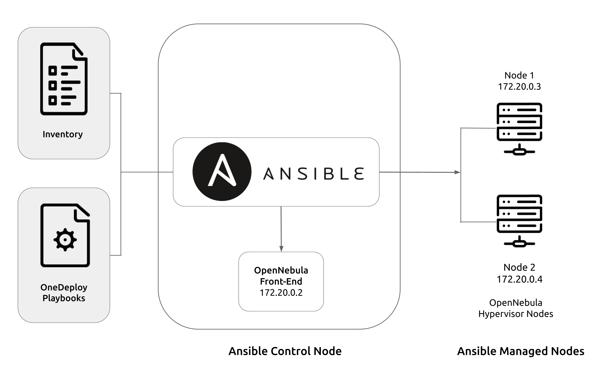

.. _one_deploy_overview:

=================================
Overview of Automatic Deployment
=================================

OpenNebula provides `OneDeploy <https://github.com/OpenNebula/one-deploy>`__, a set of Ansible playbooks that allows you to automatically deploy an OpenNebula cloud in a simple and convenient way.

`Ansible <https://www.ansible.com>`__ is a Python application for IT automation. It can deploy software, configure systems, and orchestrate complex deployments and workflows.

The Ansible playbooks in OneDeploy install a complete OpenNebula cloud, including the Front-end with the OneFlow and OneGate services, and the Sunstone UI. Before running the playbooks, you can modify variables to configure the OpenNebula cloud that will be created. For example, you can select the OpenNebula version to install, and define the network, storage configuration, and other options.

To perform automated deployments, the Ansible architecture is based on the concept of a control node and managed nodes. You designate a machine as a control node, where you will run the playbooks to deploy on the managed nodes. Nodes may be physical or virtual, and you can deploy to any nodes that you have network access to.

The basic procedure is as follows:

   #. Download the playbooks on the machine that you designate as control node, where you will run the playbooks.
   #. Modify the inventory according to your needs.
   #. Run the playbooks on the control node, to deploy on the managed nodes.

Ansible is an agentless platform, and uses SSH as the default transport for deployment. The control node must be able to communicate with the managed nodes via SSH.

|

It is worth noting that you can use the control node itself as a managed node. In the tutorials included in this documentation, the OpenNebula Front-end is installed on the Ansible control node, and the Hypervisors on the managed nodes.

In the sections below you will find a brief overview of reference architectures and requirements for installing an OpenNebula cloud with the most basic configuration. The documentation also includes two short tutorials for performing a simple installation on two of the reference architectures: using local storage for datastores, and using shared storage.

.. important:: The recommended OS for running the playbooks is Ubuntu 24.04 or 22.04. The tutorials contain configuration and commands tested on these versions. It is possible to use other OSes to perform the installation; for reference please see the `OneDeploy Wiki <https://github.com/OpenNebula/one-deploy/wiki>`__.

Reference Architectures
^^^^^^^^^^^^^^^^^^^^^^^^^^^^^^^^^^^^^^^^^^^^^

The playbooks in OneDeploy contain the configuration for two reference cloud architectures: using local storage, or shared storage for image datastores. You can deploy to both architectures with minimal configuration. Additionally, the `OneDeploy Wiki <https://github.com/OpenNebula/one-deploy/wiki>`__ details additional configurations such as Ceph storage, High-Availability for the Front-end, federation, and installing the Front-end in a VM.

Single Front-end Cloud with Local Storage
~~~~~~~~~~~~~~~~~~~~~~~~~~~~~~~~~~~~~~~~~~~

This is the most basic architecture. A single OpenNebula Front-end hosts all of the services required to run the cloud, as well as the virtual disk images for Virtual Machines. To instantiate VMs, the Front-end transfers the images to the Hypervisors where the VMs will run.

This architecture uses the most basic network configuration, a flat (bridged) network. The IPs in the virtual network are simply part of the physical network.

Single Front-end Cloud with Shared Storage
~~~~~~~~~~~~~~~~~~~~~~~~~~~~~~~~~~~~~~~~~~~

This architecture is a variation of the Local Storage architecture. In this configuration, an NFS/NAS server provides the storage for the Virtual Machines, and the image repository.

Note that the playbooks expect the NFS server to be available on the network. Before deploying, you can configure the mount point and options for the NFS shares on the OpenNebula hosts.

Requirements
^^^^^^^^^^^^^^^^^^^^^^^^^

On the control (management) node:

   * Ansible >=2.14 and <2.16
   * Passwordless SSH login, as root, from the control node to the managed nodes
   * The user that will perform the installation needs to sudo to root

On both the control node and the managed (runtime) nodes:

   * Python3, required by Ansible
   * For RHEL9 and derivatives: Network Manager
   * For Ubuntu: Netplan >=0.105

Network:

   * All nodes must be able to communicate with each other via SSH
   * The managed nodes must reside on a network with sufficient IPs available for the virtual OpenNebula network that will be created, to which the VMs will connect
   * The IP addresses to assign to the virtual network must be reachable through the main network interface on the hosts

Quick Start Tutorials
^^^^^^^^^^^^^^^^^^^^^^^^^

The documentation includes two short tutorials for quick deployment, using a few commands. To quickly get started with OneDeploy, select your preferred architecture to install an OpenNebula cloud in a few simple steps.

   * :ref:`Automated Deployment with Local Storage <one_deploy_local>`
   * :ref:`Automated Deployment with NFS Shared Storage <one_deploy_shared>`
