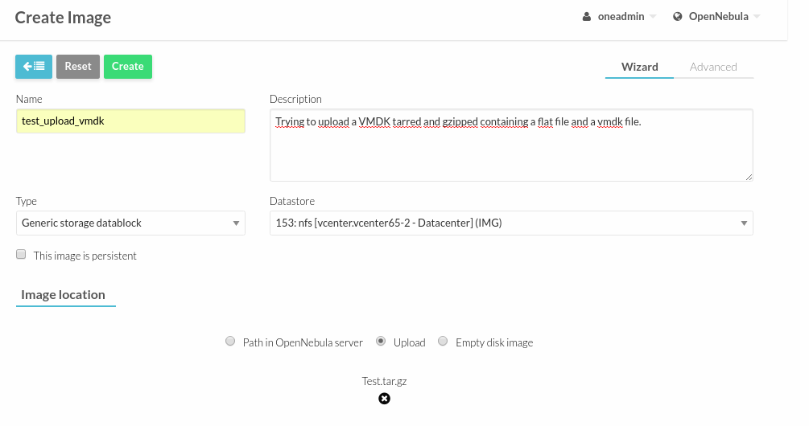
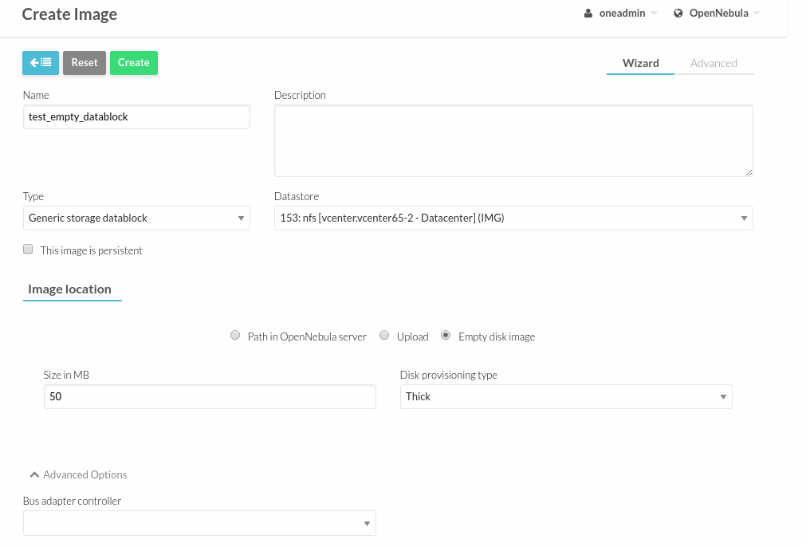

.. _vcenter_ds:

vCenter Datastores
================================================================================

vCenter datastores hosts VMDK files and other file types so VMs and templates can use them, and these datastores can be represented in OpenNebula as both an Images datastore and a System datastore:

* Images Datastore. Stores the images repository. VMDK files are represented as OpenNebula images stored in this datastore.
* System Datastore. Holds disk for running virtual machines, copied or cloned from the Images Datastore.

For example, if we have a vcenter datastore called nfs, when we import the vCenter datastore into OpenNebula, two OpenNebula datastores will be created as an Images datastore and as a System datastore pointing to the same vCenter datastores:

.. image:: /images/vcenter_datastore_import_cli.png
    :width: 50%
    :align: center

.. image:: /images/vcenter_datastore_as_image_and_system.png
    :width: 70%
    :align: center

.. important:: If the vCenter instance features a read only datastore, please be aware that you should disable the SYSTEM representation of the datastore after importing it to avoid OpenNebula trying to deploy VMs in it.

Images and disks
--------------------------------------------------------------------------------

When the vCenter hypervisor is used we have three OpenNebula image types:

* OS: A bootable disk Image. Every VM template must define one DISK referring to an Image of this type.
* CDROM: These Images are read-only data.
* DATABLOCK: A datablock Image is a storage for data. These Images can be created from previous existing data (e.g uploading a VMDK file), or as an empty drive.

OpenNebula images can be also classified in **persistent** and **non-persistent** images:

* Non-persistent images. These images are used by at least one VM. It can still be used by other VMs. When a new VM using a non-persistent image is deployed a copy of the VMDK file is created.
* Persistent images. A persistent image can be use only by a VM. It cannot be used by new VMs. The original file is used, no copies are created.

Disks attached to a VM will be backed by a non-persistent or persistent image although volatile disks are also supported. Volatile disks are created on-the-fly on the target hosts and they are disposed when the VM is shutdown.

Limitations
--------------------------------------------------------------------------------

* When a vCenter template or wild VM is imported into OpenNebula, the virtual disks are imported, an images are created in OpenNebula representing those virtual disks. Although these images represent files that already exist in the datastores, OpenNebula accounts the size of those imported images as if they were new created files and therefore the datastore capacity is decreased even though no real space in the vCenter datastore is being used by the OpenNebula images. You should understand this limitation if for example an image cannot be imported as OpenNebula reports that no more space is left or if you're using disk quotas.
* No support for disk snapshots in the vCenter datastore.
* Image names and paths cannot contain spaces or non ASCII characters.

The vCenter Transfer Manager
--------------------------------------------------------------------------------

OpenNebula’s vCenter Transfer Manager driver deals with disk images in the following way:

* New disk images created by OpenNebula are placed in an Images datastore. They can be created as persistent or non-persistent images.
* Persistent images are used by vCenter VMs from the datastore where the persistent images were created.
* Non-persistent images are copied from the Images datastore where they were created to a System datastore chosen by OpenNebula’s scheduler.
* Volatile images are created in a System datastore chosen by the scheduler and deleted from that datastore once it’s no longer needed (e.g disk detach or VM’s terminate action).
* Creation of empty datablocks and VMDK image cloning are supported, as well as image deletion.

The scheduler chooses the datastore according to the configuration in the /etc/one/sched.conf as explained in the Operation’s guide:

* By default it tries to optimize storage usage by selecting the datastore with less free space.
* It can optimize I/O by distributing the VMs across available datastores.

The vCenter datastore in OpenNebula is tied to a vCenter instance in the sense that all operations to be performed in the datastore are going to be performed through the vCenter instance, using the credentials defined on that instance.

vCenter datastores can be represented in OpenNebula to achieve the following VM operations:

  - :ref:`Upload VMDK files<vcenter_upload_vmdk>`
  - :ref:`Upload ISO files<vcenter_upload_iso>`
  - :ref:`Create empty datablocks<vcenter_create_datablock>`
  - Clone VMDKs images
  - Delete VMDK images

OpenNebula Clusters
~~~~~~~~~~~~~~~~~~~~~~~~~~~~~~~~~~~~~~~~~~~~~~~~~~~~~~~~~~~~~~~~~~~~~~~~~~~~~~~~

A :ref:`Cluster<cluster_guide>` is a group of Hosts and clusters can have associated Datastores and Virtual Networks. When a vCenter cluster is imported, the import tool assigns automatically a cluster to the OpenNebula host representing the vCenter cluster.

.. important:: When a vCenter datastore is imported into OpenNebula, OpenNebula tries to add the datastores to an existing OpenNebula cluster. If you haven't previously imported a vCenter cluster that uses that datastore, the automatic assignment won't have found a suitable OpenNebula cluster and hence the scheduler won't know which are the right datastores that can be used when a VM is deployed. In this case you should add the datastores to the cluster where the OpenNebula host (representing the vCenter Cluster) is found as explained in the :ref:`Add Resources to Clusters<cluster_guide>` section.

File location used by the Transfer Manager
~~~~~~~~~~~~~~~~~~~~~~~~~~~~~~~~~~~~~~~~~~~~~~~~~~~~~~~~~~~~~~~~~~~~~~~~~~~~~~~~

VMDK files or ISO files are placed and named into a vcenter datastore, according to these rules:

* Persistent images. These images are placed following this pattern: IMAGE_DIR/IMAGE_ID/one-IMAGE_ID.vmdk, e.g: one/258/one-258.vmdk. IMAGE_DIR is by default the directory **one** but a different directory can be used thanks to the VCENTER_DS_IMAGE_DIR attribute.
* Non-persistent images. These images are placed following this pattern: IMAGE_DIR/IMAGE_ID/one-IMAGE_ID.vmdk, e.g: one/259/one-259.vmdk. IMAGE_DIR is by default the directory **one** but a different directory can be used thanks to the VCENTER_DS_IMAGE_DIR attribute.
* Non-persistent images used by a Virtual Machine. The copy of a non-persistent image follows this pattern: IMAGE_DIR/IMAGE_ID/one-VMID-IMAGE_ID-DISK_NUMBER.vmdk where VMID is replaced with the VM numeric identifier, IMAGE_ID would be the identifier of the original image and DISK_NUMBER is replaced with the position of the disk inside the VM.
* Volatile disks attached to a VM. These images are placed following this pattern: VOLATILE_DIR/one-VMID-DISK_NUMBER.vmdk, e.g one-volatile/285/one-285-2.vmdk. VOLATILE_DIR is by default the one-volatile directory but a different directory can be used thanks to the VCENTER_DS_VOLATILE_DIR attribute.

In the following example we can see that the file associated to the Image with OpenNebula's ID 8 contains the VMDK file using the placement logic explained above.

.. image:: /images/vcenter_datastore_one_folder.png
    :width: 70%
    :align: center

.. important:: OpenNebula is commited to not leaving unneeded folders and files on your datatores, however note that in vCenter 6.5 we have detected a bug in its API that currently prevents OpenNebula to delete empty directories created by OpenNebula. Hence you may find empty folders in your datastores inside locations mentioned earlier that you may have to remove by hand if those folders bothers you somehow.

Requirements
--------------------------------------------------------------------------------

In order to use the vCenter datastore, the following requirements need to be met:

* All the ESX servers controlled by vCenter need to mount the same VMFS datastore with the same name.
* The ESX servers need to be part of the Cluster controlled by OpenNebula
* Before you can create images in an IMAGE datastore check that the datastore has been monitored and that it reports its size and usage information. You can't create images in a datastore until it's monitored.

.. _vcenter_upload_vmdk:

Upload VMDK files
--------------------------------------------------------------------------------

You can upload VMDK files that can be attached to Virtual Machines as Virtual Hard Disks.

The file containing the VMDK can be uploaded in two ways:

- Adding the file from your web browser or
- Specify the path using an URL.

The file to be uploaded can be:

- A standalone VMDK file. This file can also be compressed with gzip or bzip2.
- Flat files and a VMDK descriptor in an archived tar file. Both files must live in the first level of the archived tar file as folders and subfolders are not supported by OpenNebula inside the tar. The tar file can also be compressed with gzip or bzip2.

Using the CLI
~~~~~~~~~~~~~~~~~~~~~~~~~~~~~~~~~~~~~~~~~~~~~~~~~~~~~~~~~~~~~~~~~~~~~~~~~~~~~~~~

You can use the oneimage CLI command. Here's an example where we want to upload a standalone vmdk file to the IMAGE datastore with ID 154.

We specify the vcenter driver, type, a name and a description. The type parameter can be OS (if you want to tell OpenNebula that the image contains an Operating System), DATABLOCK and CDROM. If you want to specify other options run oneimage without parameters and you'll have a list of the parameters and some examples.

.. code::

    $ oneimage create -d 153 --type OS --name test_standalone --path /tmp/tinycore-2.1-x86.vmdk --driver vcenter --description "Upload test"
    ID: 134

The command will return the image ID. While the image is being uploaded the Image status will be LOCKED. You can check later if the status has changed to READY or ERROR.

Using Sunstone
~~~~~~~~~~~~~~~~~~~~~~~~~~~~~~~~~~~~~~~~~~~~~~~~~~~~~~~~~~~~~~~~~~~~~~~~~~~~~~~~

You have to select the IMAGE datastore where you want that file to be uploaded and specify if you want the image to be persistent or non-persistent when used by a Virtual Machine.

When you upload a VMDK file you can assign the image a type either Operating System Image or Generic Storage Datablock.

In the following example we're uploading a tar gz file containing a flat file and vmdk descriptor, using our browser. OpenNebula will upload the file to a temporary location, untar and uncompress that file and upload its contents to the vCenter datastore you've chosen.

.. warning:: If your Sunstone server is not located behind an Apache or NGINX server with Passenger, you may receive an error with the message **Cannot contact server. Is it running or reachable?** if the upload operation takes more than 30 seconds to finish. In that case you may refresh the Images window and you'll see that the new image is in the LOCKED state but the upload operation is still on course, so check it again later to see it the Image is in the READY state or ERROR.

Click on the Create button to start the file uploading process.

While the image is uploaded the status will be LOCKED, you can refresh the Images tab later to check if the status is READY to use or ERROR.

.. image:: ../../images/vcenter_vmdk_upload_sunstone_2.png
    :width: 50%
    :align: center

.. _vcenter_upload_iso:

Upload ISO files
--------------------------------------------------------------------------------

You can upload ISO files that can be used as CDROM images that can be attached to Virtual Machines.

.. note:: CDROM images files can only be attached to a Virtual Machine when it's in the POWEROFF state as the ISO files is attached to the Virtual Machine as an IDE CD-ROM drive which is not a hot-pluggable devices.

The ISO file can be uploaded in two ways:

- Adding the file from your web browser or
- Specify the path using an URL.

Using the CLI
~~~~~~~~~~~~~~~~~~~~~~~~~~~~~~~~~~~~~~~~~~~~~~~~~~~~~~~~~~~~~~~~~~~~~~~~~~~~~~~~

You can use the oneimage CLI command. Here's an example where we want to upload a standalone vmdk file to the IMAGE datastore with ID 154.

We specify the vcenter driver, type will be CDROM, a name and a description.

.. code::

    $ oneimage create -d 153 --name test_iso_file --type CDROM --path http://tinycorelinux.net/8.x/x86/release/Core-current.iso --driver vcenter --description "Upload ISO test"
    ID: 135

The command will return the image ID. While the ISO image is being uploaded the Image status will be LOCKED. You can check later if the status has changed to READY or ERROR.

Using Sunstone
~~~~~~~~~~~~~~~~~~~~~~~~~~~~~~~~~~~~~~~~~~~~~~~~~~~~~~~~~~~~~~~~~~~~~~~~~~~~~~~~

In the following example we're using an URL in Internet. OpenNebula will download the ISO file to a temporary file and then upload it to the vCenter datastore you've chosen.

.. image:: ../../images/vcenter_iso_upload_sunstone_1.png
    :width: 50%
    :align: center

.. warning:: If your Sunstone server is not located behind an Apache or NGINX server with Passenger, you may receive an error with the message **Cannot contact server. Is it running or reachable?** if the upload operation takes more than 30 seconds to finish. In that case you may refresh the Images window and you'll see that the new image is in the LOCKED state but the upload operation is still on course, so check it again later to see it the Image is in the READY state or ERROR.

Click on the Create button to start the file uploading process.

While the image is uploaded the status will be LOCKED, you can refresh the Images tab later to check if the status is READY to use or ERROR.

.. image:: ../../images/vcenter_iso_upload_sunstone_2.png
    :width: 50%
    :align: center

.. _vcenter_create_datablock:

Create empty datablocks
--------------------------------------------------------------------------------

You can easily create empty VMDK datablocks from OpenNebula.

In Sunstone you can follow these steps:

* Give the datablock a name. A description is optional.
* Select Generic storage datablock in the drop-down Type menu.
* Choose the IMAGE datastore where you want OpenNebula to create the empty datablock.
* Select Empty disk image.
* Specify the size in MB of the datablock.
* Select the disk type (Optional). You have a full list of disk types in the VCENTER_DISK_TYPE attribute description explained in the Configuration section.
* Select the bus adapter (Optional). You have a full list of controller types in the VCENTER_ADAPTER_TYPE attribute description explained in the Configuration section.

Finally click on Create.

While the VMDK file is created in the datastore the Image status will be LOCKED, you can refresh the Images tab later to check if the status is READY to use or ERROR.

.. note:: If you don't specify a disk type and/or bus adapter controller type the default values contained in the /etc/one/vcenter_driver.default file are applied. You have more information :ref:`here<vcenter_default_config_file>`.

Configuration
--------------------------------------------------------------------------------

In order to create a OpenNebula vCenter datastore that represents a vCenter VMFS datastore, a new OpenNebula datastore needs to be created with the following attributes. The :ref:`onevcenter<cli>` import tool creates a datastore representation with the required attributes.

+-----------------------------+----------------------------------------------------------------------------------------------------------------------------------------------------------------------------------------------------------------------------------------------------------------------------------------------------------------------------------------------------------------------------------------------------------------------------------------------------------------------------------------------------------------------------------------------------------------------------------------------------------------------+
|          Attribute          |                                                                                                                                                                                                                                                                                                     Description                                                                                                                                                                                                                                                                                                      |
+=============================+======================================================================================================================================================================================================================================================================================================================================================================================================================================================================================================================================================================================================================+
| ``DS_MAD``                  | Must be set to ``vcenter`` if TYPE is SYSTEM_DS                                                                                                                                                                                                                                                                                                                                                                                                                                                                                                                                                                      |
+-----------------------------+----------------------------------------------------------------------------------------------------------------------------------------------------------------------------------------------------------------------------------------------------------------------------------------------------------------------------------------------------------------------------------------------------------------------------------------------------------------------------------------------------------------------------------------------------------------------------------------------------------------------+
| ``TM_MAD``                  | Must be set ``vcenter``                                                                                                                                                                                                                                                                                                                                                                                                                                                                                                                                                                                              |
+-----------------------------+----------------------------------------------------------------------------------------------------------------------------------------------------------------------------------------------------------------------------------------------------------------------------------------------------------------------------------------------------------------------------------------------------------------------------------------------------------------------------------------------------------------------------------------------------------------------------------------------------------------------+
| ``TYPE``                    | Must be set to ``SYSTEM_DS`` or ``IMAGE_DS``                                                                                                                                                                                                                                                                                                                                                                                                                                                                                                                                                                         |
+-----------------------------+----------------------------------------------------------------------------------------------------------------------------------------------------------------------------------------------------------------------------------------------------------------------------------------------------------------------------------------------------------------------------------------------------------------------------------------------------------------------------------------------------------------------------------------------------------------------------------------------------------------------+
| ``VCENTER_ADAPTER_TYPE``    | Default adapter type used by virtual disks to plug inherited to VMs for the images in the datastore. It is inherited by images and can be overwritten if specified explicitly in the image. Possible values (careful with the case): lsiLogic, ide, busLogic. More information `in the VMware documentation <http://pubs.vmware.com/vsphere-60/index.jsp#com.vmware.wssdk.apiref.doc/vim.VirtualDiskManager.VirtualDiskAdapterType.html>`__. Known as "Bus adapter controller" in Sunstone.                                                                                                                          |
+-----------------------------+----------------------------------------------------------------------------------------------------------------------------------------------------------------------------------------------------------------------------------------------------------------------------------------------------------------------------------------------------------------------------------------------------------------------------------------------------------------------------------------------------------------------------------------------------------------------------------------------------------------------+
| ``VCENTER_DISK_TYPE``       | Type of disk to be created when a DATABLOCK is requested. This value is inherited from the datastore to the image but can be explicitly overwritten. The type of disk has implications on performance and occupied space. Values (careful with the case): delta,eagerZeroedThick,flatMonolithic,preallocated,raw,rdm,rdmp,seSparse,sparse2Gb,sparseMonolithic,thick,thick2Gb,thin. More information `in the VMware documentation <http://pubs.vmware.com/vsphere-60/index.jsp?topic=%2Fcom.vmware.wssdk.apiref.doc%2Fvim.VirtualDiskManager.VirtualDiskType.html>`__. Known as "Disk Provisioning Type" in Sunstone. |
+-----------------------------+----------------------------------------------------------------------------------------------------------------------------------------------------------------------------------------------------------------------------------------------------------------------------------------------------------------------------------------------------------------------------------------------------------------------------------------------------------------------------------------------------------------------------------------------------------------------------------------------------------------------+
| ``VCENTER_DS_REF``          | Managed Object Reference of the vCenter datastore. Please visit the :ref:`Managed Object Reference<vcenter_managed_object_reference>` section to know more about these references.                                                                                                                                                                                                                                                                                                                                                                                                                                   |
+-----------------------------+----------------------------------------------------------------------------------------------------------------------------------------------------------------------------------------------------------------------------------------------------------------------------------------------------------------------------------------------------------------------------------------------------------------------------------------------------------------------------------------------------------------------------------------------------------------------------------------------------------------------+
| ``VCENTER_DS_NAME``         | Name of the vCenter datastore                                                                                                                                                                                                                                                                                                                                                                                                                                                                                                                                                                                        |
+-----------------------------+----------------------------------------------------------------------------------------------------------------------------------------------------------------------------------------------------------------------------------------------------------------------------------------------------------------------------------------------------------------------------------------------------------------------------------------------------------------------------------------------------------------------------------------------------------------------------------------------------------------------+
| ``VCENTER_DC_REF``          | Managed Object Reference of the vCenter datacenter. Please visit the :ref:`Managed Object Reference<vcenter_managed_object_reference>` section to know more about these references.                                                                                                                                                                                                                                                                                                                                                                                                                                  |
+-----------------------------+----------------------------------------------------------------------------------------------------------------------------------------------------------------------------------------------------------------------------------------------------------------------------------------------------------------------------------------------------------------------------------------------------------------------------------------------------------------------------------------------------------------------------------------------------------------------------------------------------------------------+
| ``VCENTER_DC_NAME``         | Name of the vCenter datacenter.                                                                                                                                                                                                                                                                                                                                                                                                                                                                                                                                                                                      |
+-----------------------------+----------------------------------------------------------------------------------------------------------------------------------------------------------------------------------------------------------------------------------------------------------------------------------------------------------------------------------------------------------------------------------------------------------------------------------------------------------------------------------------------------------------------------------------------------------------------------------------------------------------------+
| ``VCENTER_INSTANCE_ID``     | The vCenter instance ID. Please visit the :ref:`Managed Object Reference<vcenter_managed_object_reference>` section to know more about these references.                                                                                                                                                                                                                                                                                                                                                                                                                                                             |
+-----------------------------+----------------------------------------------------------------------------------------------------------------------------------------------------------------------------------------------------------------------------------------------------------------------------------------------------------------------------------------------------------------------------------------------------------------------------------------------------------------------------------------------------------------------------------------------------------------------------------------------------------------------+
| ``VCENTER_HOST``            | Hostname or IP of the vCenter host                                                                                                                                                                                                                                                                                                                                                                                                                                                                                                                                                                                   |
+-----------------------------+----------------------------------------------------------------------------------------------------------------------------------------------------------------------------------------------------------------------------------------------------------------------------------------------------------------------------------------------------------------------------------------------------------------------------------------------------------------------------------------------------------------------------------------------------------------------------------------------------------------------+
| ``VCENTER_DS_IMAGE_DIR``    | (Optional) Specifies what folder under the root directory of the datastore will host persistent and non-persistent images e.g one                                                                                                                                                                                                                                                                                                                                                                                                                                                                                    |
+-----------------------------+----------------------------------------------------------------------------------------------------------------------------------------------------------------------------------------------------------------------------------------------------------------------------------------------------------------------------------------------------------------------------------------------------------------------------------------------------------------------------------------------------------------------------------------------------------------------------------------------------------------------+
| ``VCENTER_DS_VOLATILE_DIR`` | (Optional) Specifies what folder under the root directory of the datastore will host the volatile disks                                                                                                                                                                                                                                                                                                                                                                                                                                                                                                              |
+-----------------------------+----------------------------------------------------------------------------------------------------------------------------------------------------------------------------------------------------------------------------------------------------------------------------------------------------------------------------------------------------------------------------------------------------------------------------------------------------------------------------------------------------------------------------------------------------------------------------------------------------------------------+

All OpenNebula datastores are actively monitoring, and the scheduler will refuse to deploy a VM onto a vCenter datastore with insufficient free space.

.. _storage_drs_pods:

Datastore clusters with Storage DRS
-----------------------------------

Thanks to OpenNebula’s scheduler, you can manage your datastores clusters with load distribution but you may already be using `vCenter’s Storage DRS <http://pubs.vmware.com/vsphere-60/index.jsp?topic=%2Fcom.vmware.vsphere.hostclient.doc%2FGUID-598DF695-107E-406B-9C95-0AF961FC227A.html>`__ capabilities. Storage DRS allows you to manage the aggregated resources of a datastore cluster. If you're using Storage DRS, OpenNebula can delegate the decision of selecting a datastore to the Storage DRS cluster (SDRS) but as this behavior interferes with OpenNebula’s scheduler and vSphere’s API impose some restrictions, there will be some limitations in StorageDRS support in OpenNebula.

When you import a SDRS cluster using onevcenter or Sunstone:

* The cluster will be imported as a SYSTEM datastore only. vSphere’s API does not provide a way to upload or create files directly into the SDRS cluster so it can’t be used as an IMAGE datastore.
* OpenNebula detects the datastores grouped by the SDRS cluster so you can still import those datastores as both IMAGE and SYSTEM datastores.
* Non-persistent images are not supported by a SDRS as vSphere’s API does not provide a way to create, copy or delete files to a SDRS cluster as a whole, however you can use persistent and volatile images with the VMs backed by your SDRS.
* Linked clones over SDRS are not supported by OpenNebula, so when a VM clone is created a full clone is performed.

In order to delegate the datastore selection to the SDRS cluster you must inform OpenNebula's scheduler that you want to use specifically the SYSTEM datastore representing the storage cluster. You can edit a VM template and add the following expression: ID=DATASTORE_ID to the attribute SCHED_DS_REQUIREMENTS, where DATASTORE_ID must be replaced with the numeric id assigned by OpenNebula to the datastore. Thanks to this attribute OpenNebula will always use this datastore when deploying a VM. There's an alternative if you don't want to use SCHED_DS_REQUIREMENTS if you have several SYSTEM datastores in the same OpenNebula cluster associated to the vCenter cluster, you can disable all SYSTEM datastores but the one that represents your StorageDRS cluster as the scheduler will not use disabled datastores.

.. image:: /images/vcenter_datastore_storage_drs.png
    :width: 70%
    :align: center

Marketplace with vCenter Datastores
-----------------------------------

The vCenter datastores are compatible with OpenNebula HTTP and S3 marketplaces. It's necessary a generic VM Template. More information about OpenNebula marketplaces can be found :ref:`here <private_marketplace_overview>`.

Tuning and Extending
--------------------

Drivers can be easily customized please refer to the specific guide for each datastore driver or to the :ref:`Storage subsystem developer's guide <sd>`.

However you may find the files you need to modify here:

-  /var/lib/one/remotes/datastore/vcenter
-  /var/lib/one/remotes/tm/vcenter
