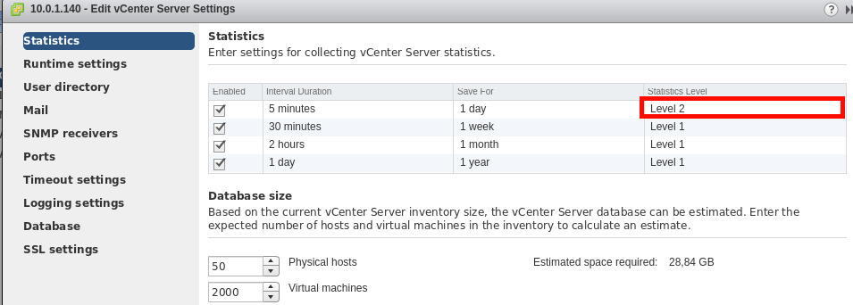

.. _vcenter_specifics:

================================================================================
VMware vCenter Virtual Machines
================================================================================

vCenter VM and VM Templates
================================================================================

To learn how to use VMs and VM Templates you can read the :ref:`Managing Virtual Machines Instances <vm_guide_2>` and :ref:`Managing Virtual Machine Templates <vm_guide>`, but first take into account the following considerations.

.. _vm_template_definition_vcenter:

OpenNebula creates VM Templates using the :ref:`import tools<vcenter_import_templates>`, but for your reference a VM Template definition in OpenNebula that represents a vCenter VM Template should contain the following attributes:

+-----------------------+-------------------------------------------------------------------------------------------------------------------------------------------------------------------------------------------------------------------------------------------------------------------------------------------------------------------------------------------+
|     Attribute         |                                                                                                                                                                     Note                                                                                                                                                                  |
+-----------------------+-------------------------------------------------------------------------------------------------------------------------------------------------------------------------------------------------------------------------------------------------------------------------------------------------------------------------------------------+
| CPU                   | Physical CPUs to be used by the VM. This does not have to relate to the CPUs used by the vCenter VM Template, OpenNebula will change the value accordingly                                                                                                                                                                                |
+-----------------------+-------------------------------------------------------------------------------------------------------------------------------------------------------------------------------------------------------------------------------------------------------------------------------------------------------------------------------------------+
| MEMORY                | Physical Memory in MB to be used by the VM. This does not have to relate to the CPUs used by the vCenter VM Template, OpenNebula will change the value accordingly                                                                                                                                                                        |
+-----------------------+-------------------------------------------------------------------------------------------------------------------------------------------------------------------------------------------------------------------------------------------------------------------------------------------------------------------------------------------+
| HYPERVISOR            | Should be set to vcenter                                                                                                                                                                                                                                                                                                                  |
+-----------------------+-------------------------------------------------------------------------------------------------------------------------------------------------------------------------------------------------------------------------------------------------------------------------------------------------------------------------------------------+
| NIC                   | One or more NIC elements. Check :ref:`VM template reference <template_network_section>`. Valid MODELs are: virtuale1000, virtuale1000e, virtualpcnet32, virtualsriovethernetcard, virtualvmxnetm, virtualvmxnet2, virtualvmxnet3.                                                                                                         |
+-----------------------+-------------------------------------------------------------------------------------------------------------------------------------------------------------------------------------------------------------------------------------------------------------------------------------------------------------------------------------------+
| DISK                  | One or more DISK elements. Check :ref:`VM template reference <reference_vm_template_disk_section>`.                                                                                                                                                                                                                                       |
+-----------------------+-------------------------------------------------------------------------------------------------------------------------------------------------------------------------------------------------------------------------------------------------------------------------------------------------------------------------------------------+
| GRAPHICS              | Multi-value - Only VNC supported, check the :ref:`VM template reference <io_devices_section>`.                                                                                                                                                                                                                                            |
+-----------------------+-------------------------------------------------------------------------------------------------------------------------------------------------------------------------------------------------------------------------------------------------------------------------------------------------------------------------------------------+
| CONTEXT               | All :ref:`sections <template_context>` will be honored except FILES. You can find more information about contextualization in the :ref:`vcenter Contextualization <vcenter_contextualization>` section.                                                                                                                                   |
+-----------------------+-------------------------------------------------------------------------------------------------------------------------------------------------------------------------------------------------------------------------------------------------------------------------------------------------------------------------------------------+
| VCENTER_RESOURCE_POOL | (Optional) By default, the VM will be deployed to the default resource pool. If this attribute is set, its value will be used to confine this the VM in the referred resource pool. Check :ref:`this section <vcenter_resource_pool>` for more information.                                                                               |
+-----------------------+-------------------------------------------------------------------------------------------------------------------------------------------------------------------------------------------------------------------------------------------------------------------------------------------------------------------------------------------+
| VCENTER_VM_FOLDER     | (Optional) If you use folders to group your objects like VMs and you want a VM to be placed inside an specific folder, you can specify a Deployment Folder where the VM will be created. The Deployment Folder is a path which uses slashes to separate folders. More info in the :ref:`VM cloning Section <vcenter_cloning_procedure>`   |
+-----------------------+-------------------------------------------------------------------------------------------------------------------------------------------------------------------------------------------------------------------------------------------------------------------------------------------------------------------------------------------+
| VCENTER_TEMPLATE_REF  | Managed Object Reference of the vCenter datastore. Please visit the :ref:`Managed Object Reference <vcenter_managed_object_reference>` section to know more about these references.                                                                                                                                                       |
+-----------------------+-------------------------------------------------------------------------------------------------------------------------------------------------------------------------------------------------------------------------------------------------------------------------------------------------------------------------------------------+
| VCENTER_TEMPLATE_NAME | Name of VM and VM Template in vCenter                                                                                                                                                                                                                                                                                                     |
+-----------------------+-------------------------------------------------------------------------------------------------------------------------------------------------------------------------------------------------------------------------------------------------------------------------------------------------------------------------------------------+
| VCENTER_CCR_REF       | Managed Object Reference of the vCenter cluster related with the template. Please visit the :ref:`Managed Object Reference <vcenter_managed_object_reference>` section to know more about these references.                                                                                                                               |
+-----------------------+-------------------------------------------------------------------------------------------------------------------------------------------------------------------------------------------------------------------------------------------------------------------------------------------------------------------------------------------+
| VCENTER_INSTANCE_ID   | The vCenter instance ID. Please visit the :ref:`Managed Object Reference <vcenter_managed_object_reference>` section to know more about these references.                                                                                                                                                                                 |
+-----------------------+-------------------------------------------------------------------------------------------------------------------------------------------------------------------------------------------------------------------------------------------------------------------------------------------------------------------------------------------+

After a VM Template is instantiated, the life-cycle of the resulting virtual machine (including creation of snapshots) can be controlled through OpenNebula. Also, all the operations available in the :ref:`Admin view <vcenter_view>` can be performed, including:

- network management operations like the ability to attach/detach network interfaces
- capacity (CPU and MEMORY) resizing
- VNC connectivity
- Attach/detach VMDK images as disks
- Resize VM disks (shrink not supported) before the VM is deployed or when the VM is in POWEROFF state.

The following operations are not available for vCenter VMs:

- migrate
- livemigrate

.. _vm_monitoring_attributes_vcenter:

The monitoring attributes retrieved from a vCenter VM are:

- VCENTER_ESX_HOST: The ESX host where the VM is running
- VCENTER_GUEST_IP: IP address reported by VMWare Tools or Open VM Tools.
- VCENTER_GUEST_STATE: The state of the VM reported by VMWare Tools or Open VM Tools.
- VCENTER_RP_NAME: Resource Pool where the VM is running. Check :ref:`this section <vcenter_resource_pool>` for more information.
- VCENTER_VMWARETOOLS_RUNNING_STATUS: The status of VMWare Tools software or Open VM Tools software.
- VCENTER_VMWARETOOLS_VERSION: The version of the VMWare Tools or Open VM Tools.
- VCENTER_VMWARETOOLS_VERSION_STATUS: The status version of the VMWare Tools or Open VM Tools.
- VCENTER_DRS: The status of the vSphere DRS (Distributed Resource Scheduler).
- VCENTER_HA: The status of the vSphere HA (High Availability).
- NETTX: Bytes transmitted.
- NETRX: Bytes received.
- DISKRDBYTES: VM disks read bytes
- DISKRDIOPS: VM disks read IOPS
- DISKWRBYTES: VM disks write bytes
- DISKWRIOPS: VM disks write IOPS
- VCENTER_VM_NAME: VM name on vCenter
- DISK_x_ACTUAL_PATH: Physical path of the disk inside the vCenter datastore

vCenter Template or Wild VM Importing Procedure
================================================================================

While a template or Wild VM is being imported, OpenNebula will inspect the virtual disks and virtual nics and it will create images and virtual networks referencing the disks and port-groups used by the VM. This process may take some time, please be patient.

You have more information about these procedures:

- :ref:`vCenter Template import <vcenter_template_import>`
- :ref:`Wild VM import <vcenter_import_wild_vms>`

.. _vcenter_cloning_procedure:

VM Template Cloning Procedure
================================================================================

OpenNebula uses VMware cloning VM Template procedure to instantiate new Virtual Machines through vCenter. From the VMware documentation:

  Deploying a virtual machine from a template creates a virtual machine that is a copy of the template. The new virtual machine has the virtual hardware, installed software, and other properties that are configured for the template.

The cloning procedure involves:

- Choosing a datastore.
- Specifying how the template disks are copied.
- Selecting a Resource Pool where the VM will run if DRS is enabled in the vCenter cluster.
- Deciding the folder where the VM will be placed inside the VM and Templates inventory view.

Choosing a datastore
--------------------------------------------------------------------------------

By default, the VM will be deployed in the datastore that the OpenNebula's scheduler chooses according to its policy.

The policy is set in the /etc/one/sched.conf configuration file and by default OpenNebula will try to deploy the VMs trying to distibute them across the available datastores.

You can force that OpenNebula uses specific datastores overriding the scheduler's policy with the SCHED_DS_REQUIREMENTS as explained :ref:`here <sched_ds>`.

It's compulsory that you import vCenter datastores before trying to deploy a VM and you must be sure that the datastores are shared by every ESX host in the cluster.

Specifying how the disks are copied
--------------------------------------------------------------------------------

OpenNebula instructs vCenter to "move all disk backing an disallow sharing". That means that vCenter will create a full clone of the disks inside the template, and that full clone flattens all disks from the parent-most to the child-most disk.

However if you import the template with Linked Clones support OpenNebula will "move only the child-most disk backing" which means that any parent disk backings should be left in their current locations and if the disks hace delta disks on top of them, then linked clones of the template disks will be used.

You have more information about disk moving operations `here <https://www.vmware.com/support/developer/vc-sdk/visdk41pubs/ApiReference/vim.vm.RelocateSpec.DiskMoveOptions.html>`__ and the use of Linked Clones :ref:`here <vcenter_linked_clones_description>`.

Selecting a Resource Pool
--------------------------------------------------------------------------------

OpenNebula uses the default cluster resource pool to place the VM instantiated from the VM template, unless VCENTER_RESOURCE_POOL variable is defined in the OpenNebula host template or VM template. You have more information about resource pools :ref:`here in OpenNebula docs<vcenter_resource_pool>`.

Deciding the VM folder in vSphere's VM and Templates view
--------------------------------------------------------------------------------

When the VM is cloned from the VM template, you can found that VM in vSphere's Web Client is by default in the same location where the vCenter template is located. For instance, using the corelinux64 vcenter template I can find the OpenNebula's VM with the one- prefix in the same folder where my template lives.

.. image:: /images/vcenter_template_in_same_location_than_vm.png
    :width: 35%
    :align: center

However you may place the VM in a different folder using the VCENTER_VM_FOLDER attribute as explained :ref:`here in OpenNebula docs <vcenter_folder_placement>`

.. _vcenter_instantiate_to_persistent:

Saving a VM Template: Instantiate to Persistent
================================================================================

At the time of deploying a VM Template, a flag can be used to create a new VM Template out of the VM.

.. prompt:: bash $ auto

  $ onetemplate instantiate <tid> --persistent

You can also use this feature from Sunstone when you instantiate a template:

.. image:: /images/vcenter_instantiate_as_persistent_1.png
    :width: 35%
    :align: center

OpenNebula does the following when you use Instantiate to Persistent:

* A copy of every disk in the template is made and stored as OpenNebula images. Unmanaged disks which are disks that have OPENNEBULA_MANAGED attribute set to NO and that represents the disks that already exists in the vCenter template will be copied as non-persistent images. The rest of the disks will be represented as persistent images. Note that volatile disks won't have an image associated.
* A new OpenNebula template will be created and the disks added in the previous step will be included in the template.
* Whenever the VM life-cycle ends (a VM terminate action), OpenNebula will instruct vCenter to create a new vCenter template out of the VM, with the settings of the VM.
* The OpenNebula VM template will point to the new vCenter template, so it can be instantiated through OpenNebula.

This functionality is very useful to create new VM Templates from a original VM Template, changing the VM configuration and/or installing new software, to create a complete VM Template catalog.

.. important:: Don’t detach disks from the VM or resize any disk of the VM once you’ve deployed it with Instantiate as Persistent, as when the VM is terminated the OpenNebula template that was created before the VM was deployed will differ from the template created in vCenter. Differences between the templates may affect operations on VMs based on unsynced templates.

.. _vcenter_save_as_template:

Saving a VM Template: Save As
================================================================================

In the Sunstone's cloud_vcenter view you can poweroff a VM an use the save icon to create a new OpenNebula template from this VM.

.. image:: /images/vcenter_save_as_template_1.png
    :width: 35%
    :align: center

OpenNebula will offer to create a copy of the disks, select non-persistent images or persistent images.

.. image:: /images/vcenter_save_as_template_2.png
    :width: 35%
    :align: center

a message will inform you that the new OpenNebula template has been created and the VM will show the state SAVING_IMAGE.

.. image:: /images/vcenter_save_as_template_3.png
    :width: 35%
    :align: center

Refresh the VM state with the icon next to the VM's name, you'll see the VM in OFF state when your new OpenNebula template is ready to use in the templates tab.

Your new VM template will contain DISK elements that will point to the disk copies created and NIC elements that will point to the same OpenNebula virtual networks used by the VM this template is based on.

Note that the new OpenNebula template has a :ref:`Managed Object Reference <vcenter_managed_object_reference>` to the vCenter template used to create the original VM. This implies that when a VM is deployed from the new OpenNebula template, a VM will be cloned from the original vCenter template where the old disks will be detached and the disk copies that were created previously will be attached.

.. _vm_scheduling_vcenter:

VM Scheduling
================================================================================

OpenNebula scheduler should only chose a particular OpenNebula host for a OpenNebula VM Template representing a vCenter VM Template, since it most likely only would be available in a particular vCenter cluster.

The scheduler will inspect the VM Template and it will choose to deploy the VM in an OpenNebula host which is member of an OpenNebula cluster that contains the datastores where the DISKs images are stored and that contains the virtual networks used by the NICs elements of the VM template. When a vCenter cluster is imported into OpenNebula an OpenNebula Host that represents that vCenter cluster is created and that OpenNebula Host is added to an OpenNebula Cluster that is created by default if no other OpenNebula cluster is selected. Note that if you import a vCenter templatee which has no disks or networks, OpenNebula Scheduler's won't be able to decide on which OpenNebula host (vCenter cluster) it can use to deploy the VM.

.. note:: If a VM is stuck in the PENDING state, that means that the scheduler hasn't found a host and datastores that satisfies its requirement. In this case check that the images and networks defined in the VM template are located in an OpenNebula cluster other than the default cluster and check that the OpenNebula host is also assigned to the same OpenNebula cluster.

Since a vCenter cluster is an aggregation of ESX hosts, the ultimate placement of the VM on a particular ESX host would be managed by vCenter, in particular by the `Distribute Resource Scheduler (DRS) <https://www.vmware.com/es/products/vsphere/features/drs-dpm>`__.

In Sunstone, a host abstracting a vCenter cluster will have an extra tab showing the ESX hosts that conform the cluster.

.. image:: /images/host_esx.png
    :width: 90%
    :align: center

.. _vcenter_attach_cdrom:

Attaching a CDROM to a Virtual Machine
================================================================================

You can attach a CDROM to a Virtual Machine :ref:`creating first an OpenNebula image from an ISO file<vcenter_upload_iso>`.

Then the CDROM can be attached to a Virtual Machine template or can be attached to deployed Virtual Machine, **ONLY** if the Virtual Machines is in the POWEROFF state. OpenNebula tries to connect the ISO file as an IDE CD-ROM drive which is not a hot-pluggable device that's why the Virtual Machine must not be RUNNING (powered on).

.. _disk_monitoring:

Disks monitoring
================================================================================

OpenNebula gathers disks monitoring info for each VM providing metrics like the rate of reading/writing data to the VM's virtual disks and the read/write IOPS. Real-time data is retrieved from vCenter thanks to the Performance Manager which collects data every 20 seconds and maintains it for one hour.

.. important:: OpenNebula requires that you set the right Statistics Level so disk metrics are generated and stored by vCenter. Increasing the statistics level implies that more space is needed to store metrics so check that you have enough storage before changing the level.

vCenter Statistics level for 5-minutes data must be set to 2.

The rate of reading/write is provided by vCenter as an average using KB/s unit. The graphs provided by Sunstone are different from those found in vCenter under the Monitor -> Performance Tab when selecting Realtime in the Time Range drop-down menu. The reason is that Sunstone uses polling time as time reference while vCenter uses sample time on their graphs, so an approximation to the real values aggregating vCenter's samples between polls is needed. As a result, peaks may be different in value and different peaks between polls won't be depicted. Sunstone's graphs will provide a useful information about disks behaviour which can be examined on vCenter later with greater detail.

.. _vcenter_images_operations:

vCenter Images
================================================================================

You can follow the :ref:`Managing Images Section <images>` to learn how to manage images, considering that VMDK snapshots are not supported as well as the following considerations.

Existing disks in vCenter VM Templates or Wild VMs will be imported in OpenNebula with information about those disks. OpenNebula will scan templates and Wild VMs for existing disks and it will create OpenNebula images that will represent those virtual disks. Thanks to this scanning process, existing disks will be visible for OpenNebula, and therefore can be detached from the deployed VMs. The following information is important about images created when a vCenter template or Wild VM is imported:

- The disks are considered unmanaged images.
- An unmanaged image won't be cloned by OpenNebula when a VM is instantiated. When OpenNebula deploys a VM, vCenter will clone the vCenter template and it will be  responsible of creating the copies of the template disks and attach them to the new Virtual Machine.
- Although the images are considered unmanaged, you can perform operations like detaching the disks.
- Virtual Machines in vCenter will have some variables created by OpenNebula that allows an OpenNebula disk element to be related with a vCenter Virtual Hard Disk. For example the unmanaged DISK with ID=0 has a variable called opennebula.disk.0 in vCenter's VM that stores a reference to the disk created by vCenter that will help OpenNebula identify what disk has to be detached.
- The VCENTER_IMPORTED attribute is set to YES in the Image template for prevent accidental deletions.
- Although these images represents files that already exists in the datastores, OpenNebula accounts the size of those imported images as if they were new created files hence the datastore capacity is decreased even though no real space in the vCenter datastore is being used by the OpenNebula images. You should understand this limitation if for example an image cannot be imported as OpenNebula reports that no more space is left or if you're using disk quotas.
- The images that have been imported will have a name generated by OpenNebula. That name contains the name of the VMDK file, the datastore name and the OpenNebula template that is related with that image.

There are three ways of adding VMDK representations in OpenNebula:

- :ref:`Upload a new VMDK from the local filesystem<vcenter_upload_vmdk>`
- :ref:`Register an existent VMDK image already in the datastore<vcenter_import_images>`
- :ref:`Create a new empty datablock<vcenter_create_datablock>`

The following image template attributes need to be considered for vCenter VMDK image representation in OpenNebula:

+-----------------------------+--------------------------------------------------------------------------------------------------------------------------------------------------------------------------------------------------------------------------------------------------------------------------------------------------------------------------------------------------------------------------------------------------------------------+
|    Attribute                |                                                                                                                                                                                                    Description                                                                                                                                                                                                     |
+=============================+====================================================================================================================================================================================================================================================================================================================================================================================================================+
| ``PATH``                    | This can be either:                                                                                                                                                                                                                                                                                                                                                                                                |
|                             |                                                                                                                                                                                                                                                                                                                                                                                                                    |
|                             | * local filesystem path to a VMDK to be uploaded, which can be a single VMDK or tar.gz of vmdk descriptor and flat files (no OVAs supported). If using a tar.gz file which contains the flat and descriptor files, both files must live in the first level of the archived file as folders and subfolders are not supported inside the tar.gz file, otherwise a "Could not find vmdk" error message would show up. |
|                             | * path of an existing VMDK file in the vCenter datastore or HTTP url. In this case a ''vcenter://'' prefix must be used (for instance, an image win10.vmdk in a Windows folder should be set to vcenter://Windows/win10.vmdk)                                                                                                                                                                                      |
|                             |                                                                                                                                                                                                                                                                                                                                                                                                                    |
+-----------------------------+--------------------------------------------------------------------------------------------------------------------------------------------------------------------------------------------------------------------------------------------------------------------------------------------------------------------------------------------------------------------------------------------------------------------+
| ``VCENTER_ADAPTER_TYPE``    | Default adapter type used by virtual disks to plug inherited to VMs for the images in the datastore.                                                                                                                                                                                                                                                                                                               |
|                             | It is inherited by images and can be overwritten if specified explicitly in the image. Possible values (careful with the case): lsiLogic, ide, busLogic. More information `in the VMware documentation <http://pubs.vmware.com/vsphere-60/index.jsp#com.vmware.wssdk.apiref.doc/vim.VirtualDiskManager.VirtualDiskAdapterType.html>`__. Known as "Bus adapter controller" in Sunstone.                             |
+-----------------------------+--------------------------------------------------------------------------------------------------------------------------------------------------------------------------------------------------------------------------------------------------------------------------------------------------------------------------------------------------------------------------------------------------------------------+
| ``VCENTER_DISK_TYPE``       | The type of disk has implications on performance and occupied space. Values (careful with the case):  delta,eagerZeroedThick,flatMonolithic,preallocated,raw,rdm,rdmp,seSparse,sparse2Gb,sparseMonolithic,thick,thick2Gb,thin. More information `in the VMware documentation <http://pubs.vmware.com/vsphere-60/index.jsp?topic=%2Fcom.vmware.wssdk.apiref.doc%2Fvim.VirtualDiskManager.VirtualDiskType.html>`__.  |
|                             | Known as "Disk Provisioning Type" in Sunstone.                                                                                                                                                                                                                                                                                                                                                                     |
+-----------------------------+--------------------------------------------------------------------------------------------------------------------------------------------------------------------------------------------------------------------------------------------------------------------------------------------------------------------------------------------------------------------------------------------------------------------+
| ``VCENTER_IMPORTED``        | It will be set to YES for images that have been imported when a vCenter template or Wild VM is imported. If this attribute is set to YES, OpenNebula **will not delete** the VMDK file in vCenter so you don't actually delete the hard disk attached to a template. If you remove this attribute the VMDK file will be deleted when the Image is deleted in OpenNebula.                                           |
+-----------------------------+--------------------------------------------------------------------------------------------------------------------------------------------------------------------------------------------------------------------------------------------------------------------------------------------------------------------------------------------------------------------------------------------------------------------+

VMDK images in vCenter datastores can be:

- Cloned
- Deleted
- Hotplugged to VMs

Images can be imported from the vCenter datastore using the :ref:`onevcenter<vcenter_import_images>` tool.

.. warning:: Both "VCENTER_ADAPTER_TYPE" and "VCENTER_DISK_TYPE" need to be set at either the Datastore level, the Image level or the VM Disk level. If not set, default values in /etc/one/vcenter_driver.defaults file should be used.

.. warning:: Images spaces are not allowed for import

.. note:: By default, OpenNebula checks the datastore capacity to see if the image fits. This may cause a "Not enough space in datastore" error. To avoid this error, disable the datastore capacity check before importing images. This can be changed in /etc/one/oned.conf, using the DATASTORE_CAPACITY_CHECK set to "no".

.. _vcenter_tags_and_categories:

vCenter Tags and Categories
================================================================================

Working with vCenter tags and categories can be extremely helpful. It allows to add valuable information to inventory items and make them searchable and sortable.

To assign a Label and Category to a VM add the following block to the Template definition before instantiating it. Several blocks can be added as needed.

.. code-block:: text

    VCENTER_TAG = [
        CATEGORY_NAME = "Category name",
        DESCRIPTION = "Tag description",
        NAME = "Tag name"]

OpenNebula uses the ``CATEGORY_NAME`` field to create a Category in case there is no Category with this name. If a ``CATEGORY_NAME`` is not supplied, OpenNebula will create a default category called ``OpenNebula``.

OpenNebula uses the ``NAME`` and ``DESCRIPTION`` fields to create a ``TAG`` with this name and description that belongs to the category.

.. _vcenter_live_resize:

vCenter Live Resize
================================================================================

To enable resize for a virtual machine, add the following block to the template definition before creating an instance or in the ``USER_TEMPLATE`` directly in the Virtual Machine.

.. code-block:: text

    HOT_RESIZE = [
        CPU_HOT_ADD_ENABLED = "YES",
        MEMORY_HOT_ADD_ENABLED = "YES"]

OpenNebula uses the ``CPU_HOT_ADD_ENABLED`` field to activate or desactivate the CPU Hot resize in vCenter. If a ``CPU_HOT_ADD_ENABLED`` is not supplied or the value is ``NO``, OpenNebula will desactivate the CPU Hot resize in vCenter.

OpenNebula uses the ``MEMORY_HOT_ADD_ENABLED`` field to activate or desactivate the MEMORY Hot resize in vCenter. If a ``MEMORY_HOT_ADD_ENABLED`` is not supplied or the value is ``NO``, OpenNebula will desactivate the MEMORY Hot resize in vCenter.

.. important:: To activate or deactivate these options it is necessary to turn off and resume the Virtual Machine. since vCenter does not allow changing these settings with the Virtual Machine turned on.

.. warning:: CPU Hot Add is a feature that allows the addition of vCPUs to a running virtual machine. Enabling this feature disables vNUMA for that Virtual Machine. You can find more info here in this `VMware KB article 2040375 <https://kb.vmware.com/s/article/2040375>`__

You can find more information on how to resize a Virtual Machine in OpenNebula using the CLI or in Sunstone :ref:`here <vm_guide2_resizing_a_vm>`
