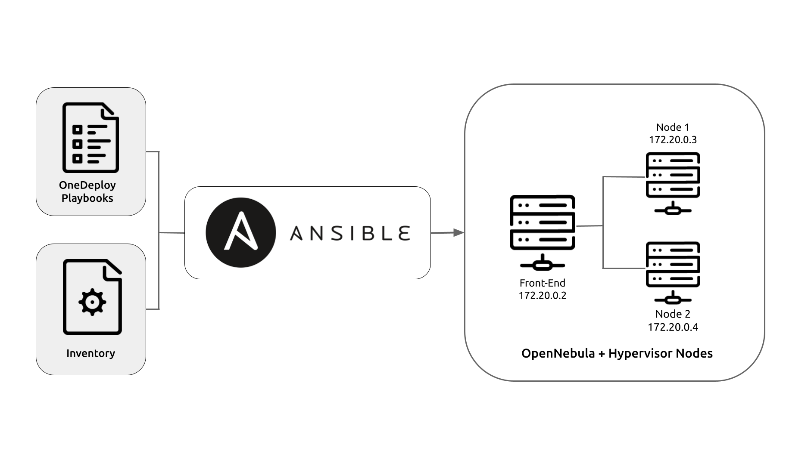

.. _one_deploy_overview:

=====================================================
Quick Install: Automated Deployment Using OneDeploy
=====================================================

Overview
^^^^^^^^^

OpenNebula provides `OneDeploy <https://github.com/OpenNebula/one-deploy>`__, a set of Ansible playbooks that allows you to automatically deploy an OpenNebula cloud in a simple and convenient way.

`Ansible <https://www.ansible.com>`__ is a Python application for IT automation. It can deploy software, configure systems, and orchestrate complex deployments and workflows.

The Ansible playbooks in OneDeploy install a complete OpenNebula cloud, including the Front-end with the OneFlow and OneGate services, and the Sunstone UI. Before running the playbooks, you can modify these variables to configure the OpenNebula cloud that will be created. For example, you can select the OpenNebula version to install, as well as define the network, storage and other options.

To perform automated deployments, the Ansible architecture is based on the concept of a control node and managed nodes. You designate a server as a control node, where you will run the playbooks to deploy on the managed nodes. In this case, the managed nodes will be the servers where OneDeploy will install the OpenNebula Front-end and hypervisor hosts.

The basic procedure is as follows:

   #. Download the playbooks on the server that you designate as control node, where you will run the playbooks.
   #. Modify the inventory according to your needs.
   #. Run the playbooks on the control node, to deploy on the managed nodes.

Ansible is an agentless platform, and uses SSH as the default transport for deployment. The control node must be able to communicate with the managed nodes via SSH.

|

In the sections below you will find a brief overview of architectures and requirements for installing an OpenNebula cloud on the most basic architecture. The documentation also includes two simple tutorials for performing a simple installation on two of the reference architectures: with local storage for datastores, and with shared storage.

.. important:: The recommended OS for using the playbooks is Ubuntu 24.04. All configuration and commands in the tutorials are in reference to this OS. While it is possible to use other OSes to perform the installation, these are out of the scope of the tutorial. For the complete OneDeploy documentation, please refer to the `OneDeploy Wiki <https://github.com/OpenNebula/one-deploy/wiki>`__.

Reference Architectures
^^^^^^^^^^^^^^^^^^^^^^^^^^^^^^^^^^^^^^^^^^^^^

The playbooks in OneDeploy contain the configuration for two reference cloud architectures, which you can deploy to with minimal configuration.

Single Front-end with Local Storage
~~~~~~~~~~~~~~~~~~~~~~~~~~~~~~~~~~~~~~~~~~~

This is the most basic architecture. A single OpenNebula Front-end hosts all of the services required to run the cloud, as well as the virtual disk images for Virtual Machines. To initiate, VMs the Front-end transfers the images to the hypervisors.

This architecture uses the most basic network configuration, a flat (bridged) network. The IPs used in the virtual network will be simply part of the physical network.

Single Front-end with Shared Storage
~~~~~~~~~~~~~~~~~~~~~~~~~~~~~~~~~~~~~~~~~~~

This architecture is a variation of the Local Storage architecture. In this configuration, an NFS/NAS server provides the storage for the Virtual Machines, and the image repository.

Note that the playbooks expect the NFS server to be available on the network. The playbooks do allow you to configure the mount point for the NFS shares on the hosts.

Requirements
^^^^^^^^^^^^^^^^^^^^^^^^^

On the control node:

   * Ansible >=2.14 and <2.16
   * Passwordless SSH login, as root, from the control node to the managed nodes
   * The user that will perform the installation needs to sudo to root

On all nodes:

   * Python3, required by Ansible
   * For RHEL9 and derivatives: Network Manager
   * For Ubuntu: Netplan >=0.105

Network:

   * All nodes must be able to communicate with each other via SSH
   * The managed nodes must reside on a network with sufficient IPs available for the virtual OpenNebula network that will be created, to which the VMs will connect
   * The IP addresses to assign to the virtual network must be reachable through the main network interface on the hosts

Quick Start Tutorials
^^^^^^^^^^^^^^^^^^^^^^^^^

The documentation includes two short tutorials for quick deployment, using a few commands. To quickly get started with OneDeploy, select your preferred architecture to install an OpenNebula cloud in a few simple steps.

* :ref:`Tutorial: Installation with Local Storage <one_deploy_local>`
* :ref:`Tutorial: Installation with NFS Shared Storage <one_deploy_shared>`

