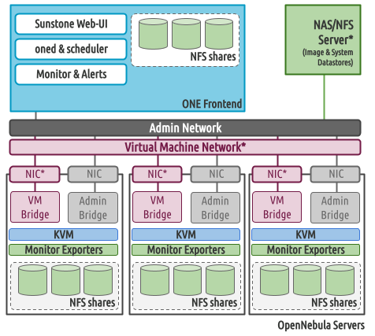
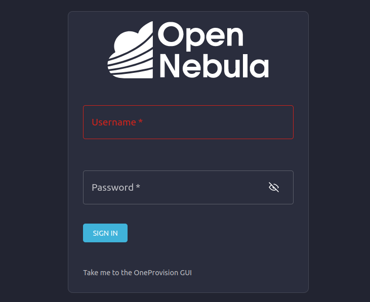

.. _one_deploy_shared:
.. _od_shared:

========================================================
Tutorial: Automated Cloud Deployment with Shared Storage
========================================================

Overview
^^^^^^^^^^^^^^^^^^^^^^

In this tutorial, we’ll use `OneDeploy <https://github.com/OpenNebula/one-deploy>`__ to automatically deploy a simple OpenNebula cloud, with one Front-end and two Hosts using storage shared over NFS. In this configuration, the OpenNebula Front-end and Hypervisor nodes read datastore images from an NFS share available on the network.

This sample architecture uses a basic network configuration, a flat (bridged) network, where the VM’s IPs are part of the same network as the Hypervisors.

Throughout the tutorial we’ll use three server machines, please be sure to replace these references to your own IP addresses:

   * OpenNebula Front-end: 172.20.0.10
   * Hypervisor (Host) 1: 172.20.0.11
   * Hypervisor (Host) 2: 172.20.0.12

We’ll follow these high-level steps:

   #. Set up the Ansible control node (for example, install Ansible if necessary).
   #. Download the Ansible playbooks.
   #. Modify the playbooks to your needs, e.g. set the OpenNebula version, define the virtual network for the hosts, storage options, etc.
   #. Run the playbooks.
   #. Verify the installation.

.. important:: This tutorial was designed and tested using Ubuntu 24.04 or 22.04 for all servers involved (i.e. OpenNebula front-end and hypervisor nodes) using a virtual environment with `Poetry <https://python-poetry.org/>`__ . For information on other installation methods and OSes, please refer to the `OneDeploy Wiki <https://github.com/OpenNebula/one-deploy/wiki>`__.

Requirements
^^^^^^^^^^^^^^^^^^^^^^

The following requirements must be met for your cloud hosts (Front-end and Hypervisors):

   * Ubuntu 22.04 or 24.04 with Netplan >=0.105
   * Passwordless SSH login, as root, from the Front-end node to the Hypervisors nodes
   * The user that will perform the installation needs to be able to sudo to the root account
   * A range of free IPs in the same network connecting the Front-end and Hypervisors

In this tutorial we assume there is a NFS server already available for your cloud. In this example we assume that the following structure is created in the NFS/NAS sever:

.. prompt:: bash # auto

    root@nfs-server:/# ls -ln /storage
    total 0
    drwxr-xr-x 2 9869 9869 6 Jun 26 17:55 one_datastores

.. important:: The ownership of the folders **MUST** be 9869 as this is the UID/GID assigned to the `oneadmin` account during the installation.

This folder is exported to all the OpenNebula servers in the cloud, in our example:

.. code:: shell

    # /etc/exports
    #
    # See exports(5) for more information.
    #
    # Use exportfs -r to reread
    # /export	192.168.1.10(rw,no_root_squash)
    /storage/one_datastores 172.20.0.0/24(rw,soft,intr,async)

Installing OneDeploy in the Front-end
^^^^^^^^^^^^^^^^^^^^^^^^^^^^^^^^^^^^^

First, in the Front-end we’ll install two packages for Python:

   * ``pip``, the Python package installer
   * Poetry, a Python dependency manager

To install the packages, run:

.. code::

   sudo apt install python3-pip python3-poetry

Clone the ``one-deploy`` repository:

.. code::

   git clone https://github.com/OpenNebula/one-deploy.git

Go to the ``one-deploy`` directory:

.. code::

   cd one-deploy

Install the necessary components for the installation by running:

.. code::

   make requirements

Poetry will create the virtual environment and install the necessary components:

.. prompt:: bash # auto

   front-end:~/one-deploy$ make requirements
   poetry update --directory /home/basedeployer/one-deploy/
   Creating virtualenv one-deploy-Yw-1D8Id-py3.12 in /home/basedeployer/.cache/pypoetry/virtualenvs
   Updating dependencies
   Resolving dependencies... (3.6s)

   Package operations: 40 installs, 0 updates, 0 removals

     - Installing attrs (24.2.0)
     - Installing pycparser (2.22)
     - Installing rpds-py (0.20.0)
     - Installing cffi (1.17.0)
     - Installing markupsafe (2.1.5)
     - Installing mdurl (0.1.2)
     - Installing referencing (0.35.1)
     - Installing cryptography (43.0.0)
     - Installing jinja2 (3.1.4)
     - Installing jsonschema-specifications (2023.12.1)
     - Installing markdown-it-py (3.0.0)
     - Installing packaging (24.1)
     - Installing pygments (2.18.0)
     - Installing pyyaml (6.0.2)
     - Installing resolvelib (1.0.1)
     - Installing ansible-core (2.15.12)
     - Installing bracex (2.5)

To list the available environments, run:

.. code::

   poetry env list

Poetry should display the newly-created environment:

.. prompt:: bash # auto

   front-end:~/one-deploy$ poetry env list
   one-deploy-Yw-1D8Id-py3.12 (Activated)

Now you can switch to the virtual environment:

.. code::

   poetry shell

After switching to the virtual environment, the string ``(one-deploy-py3.12)`` is included in your terminal prompt:

.. prompt:: bash # auto

   front-end:~/one-deploy$ poetry shell
   Spawning shell within /home/basedeployer/.cache/pypoetry/virtualenvs/one-deploy-Yw-1D8Id-py3.12
   front-end:~/one-deploy$ . /home/basedeployer/.cache/pypoetry/virtualenvs/one-deploy-Yw-1D8Id-py3.12/bin/activate
   (one-deploy-py3.12) front-end:~/one-deploy$

Configuring Cloud Parameters
^^^^^^^^^^^^^^^^^^^^^^^^^^^^^^^^^^^^^^^^

Create a directory, which for this tutorial we’ll call ``my-one``, and go to this directory:

.. code::

   mkdir my-one
   cd my-one

In this directory we’ll create and edit two files:

   * ``shared.yml`` - Contains the definitions for the OpenNebula installation
   * ``ancible.cfg`` - Ansible configuration file

Below are sample contents for ``shared.yml``. You will probably need to modify parameters for the OpenNebula installation, such as the IP addresses for the Front-end and virtualization nodes.

.. prompt:: bash # auto

   ---
   all:
     vars:
       ansible_user: root
       one_version: '6.10'
       one_pass: opennebulapass
       vn:
         service:
           managed: true
           template:
             VN_MAD: bridge
             BRIDGE: br0
             AR:
               TYPE: IP4
               IP: 172.20.0.100
               SIZE: 48
             NETWORK_ADDRESS: 172.20.0.0
             NETWORK_MASK: 255.255.255.0
             GATEWAY: 172.20.0.1
             DNS: 1.1.1.1

   ds: { mode: shared }

   fstab:
     - src: "172.20.0.5:/storage/one_datastores"

   frontend:
     hosts:
       f1: { ansible_host: 172.20.0.10 }

   node:
     hosts:
       n1: { ansible_host: 172.20.0.11 }
       n2: { ansible_host: 172.20.0.12 }

The table below lists some of the parameters, please update them to your setup:

+-------------------+-------------------------------------------------------------------------------------------------+
| Parameter         | Description                                                                                     |
+===================+=================================================================================================+
| ``one_version``   | The OpenNebula version to install.                                                              |
+-------------------+-------------------------------------------------------------------------------------------------+
| ``one_pass``      | Password for the OpenNebula user ``oneadmin``.                                                  |
+-------------------+-------------------------------------------------------------------------------------------------+
| ``vn``            | Parameters for the OpenNebula virtual network (``service``) that will be created for the VMs.   |
+-------------------+-------------------------------------------------------------------------------------------------+
| ``PHYDEV``        | The physical interface on the servers that will attach to the virtual network.                  |
+-------------------+-------------------------------------------------------------------------------------------------+
| ``AR``            | Address range (first ``IP`` and ``SIZE``) available to assign to the VMs.                       |
+-------------------+-------------------------------------------------------------------------------------------------+
| ``GATEWAY``       | Default gateway for the network.                                                                |
+-------------------+-------------------------------------------------------------------------------------------------+
| ``DNS``           | DNS server of the network.                                                                      |
+-------------------+-------------------------------------------------------------------------------------------------+
| ``f1,n1,n2``      | ``ansible_host`` IP address for the front-end (``f1``) and Hypervisors (``n1`` and ``n2``).     |
+-------------------+-------------------------------------------------------------------------------------------------+
| ``fstab``         | The NFS share for accessing datastores, in <host>:<folder> format.                              |
+-------------------+-------------------------------------------------------------------------------------------------+

In this example, the Front-end will be installed on the server with IP 172.20.0.10, and the two Hypervisors on 0.11 and 0.12, respectively. The virtual network will be bridged through the ``eth0`` interface of the Hypervisors, and VMs will get IP addresses within the range ``172.20.0.100 - 172.20.0.147``, using ``172.20.0.1`` as the default gateway. The NFS server resides on 172.20.0.5, and shares the directory ``/storage/one_datastores``.

Below are the contents of the ``ansible.cfg`` file:

.. prompt:: bash # auto

  [defaults]
   inventory=./shared.yml
   gathering=explicit
   host_key_checking=false
   display_skipped_hosts=true
   retry_files_enabled=false
   any_errors_fatal=true
   stdout_callback=yaml
   timeout=30
   collections_paths=/home/user/one-deploy/ansible_collections

   [ssh_connection]
   pipelining=true
   ssh_args=-q -o ControlMaster=auto -o ControlPersist=60s

   [privilege_escalation]
   become      = true
   become_user = root

Note that you will need to replace the contents of ``collections_paths`` with the correct path to your ``one-deploy`` directory.

Verifying Connectivity Between Nodes
^^^^^^^^^^^^^^^^^^^^^^^^^^^^^^^^^^^^^^^^

After configuring parameters for your cloud, it’s a good idea to ensure that the required connectivity between nodes is working.

To verify connectivity, run this command:

.. code::

   ansible -i shared.yml all -m ping -b

Example command and output:

.. prompt:: bash # auto

   (one-deploy-py3.12) front-end:~/one-deploy$ ansible -i shared.yml all -m ping -b 
   f1 | SUCCESS => {
       "ansible_facts": {
           "discovered_interpreter_python": "/usr/bin/python3"
       },
       "changed": false,
       "ping": "pong"
   }
   n2 | SUCCESS => {
       "ansible_facts": {
           "discovered_interpreter_python": "/usr/bin/python3"
       },
       "changed": false,
       "ping": "pong"
   }
   n1 | SUCCESS => {
       "ansible_facts": {
           "discovered_interpreter_python": "/usr/bin/python3"
       },
       "changed": false,
       "ping": "pong"
   }

If any host is unreachable, you will see output like the following:

.. prompt:: bash # auto

   n2 | UNREACHABLE! => {
       "changed": false,
       "msg": "Data could not be sent to remote host \"172.20.0.11\". Make sure this host can be reached over ssh: ",
       "unreachable": true
   }

Running the Playbooks
^^^^^^^^^^^^^^^^^^^^^^^^

Once you have edited the files, it’s time to run the Ansible playbooks.

First, ensure you are in the Poetry environment by verifying that your terminal prompt begins with ``(one-deploy-py3.12)``.

In the ``my-one`` directory, run this command:

.. code::

   ansible-playbook -v opennebula.deploy.main

The Ansible playbooks should run and perform the installation. Installation may take several minutes, depending on your network connection speed.

Sample installation output:

.. prompt:: bash # auto

   (one-deploy-py3.12) front-end:~/my-one$ ansible-playbook -v opennebula.deploy.main
   Using /home/basedeployer/my-one/ansible.cfg as config file
   running playbook inside collection opennebula.deploy
   [WARNING]: Could not match supplied host pattern, ignoring: bastion

   PLAY [bastion] *******************************************************************************************
   skipping: no hosts matched
   [WARNING]: Could not match supplied host pattern, ignoring: grafana
   [WARNING]: Could not match supplied host pattern, ignoring: mons
   [WARNING]: Could not match supplied host pattern, ignoring: mgrs
   [WARNING]: Could not match supplied host pattern, ignoring: osds

   PLAY [frontend,node,grafana,mons,mgrs,osds] **************************************************************

   TASK [opennebula.deploy.helper/python3 : Bootstrap python3 intepreter] ***********************************
   skipping: [f1] => changed=false
     attempts: 1
     msg: /usr/bin/python3 exists, matching creates option
   skipping: [n2] => changed=false
     attempts: 1
     msg: /usr/bin/python3 exists, matching creates option
   skipping: [n1] => changed=false
     attempts: 1
     msg: /usr/bin/python3 exists, matching creates option

   ...

   TASK [opennebula.deploy.prometheus/server : Enable / Start / Restart Alertmanager service (NOW)] *********
   skipping: [f1] => changed=false
     false_condition: features.prometheus | bool is true
     skip_reason: Conditional result was False

   PLAY [grafana] *******************************************************************************************
   skipping: no hosts matched

   PLAY RECAP ***********************************************************************************************
   f1                         : ok=84   changed=33   unreachable=0    failed=0    skipped=75   rescued=0    ignored=0   
   n1                         : ok=37   changed=12   unreachable=0    failed=0    skipped=57   rescued=0    ignored=0   
   n2                         : ok=37   changed=12   unreachable=0    failed=0    skipped=48   rescued=0    ignored=0

After the command completes, your new OpenNebula cloud should be up and running.

Verifying the Installation
^^^^^^^^^^^^^^^^^^^^^^^^^^^^^^^^^^

On the Front-end, you can check that the OpenNebula services are running with: ``systemctl status opennebula.service``, as shown below:

.. prompt:: bash # auto

   systemctl status opennebula.service
   ● opennebula.service - OpenNebula Cloud Controller Daemon
        Loaded: loaded (/usr/lib/systemd/system/opennebula.service; enabled; preset: enabled)
        Active: active (running) since Mon 2024-08-12 14:44:25 UTC; 1 day 6h ago
      Main PID: 7023 (oned)
         Tasks: 74 (limit: 9290)
        Memory: 503.9M (peak: 582.2M)
           CPU: 4min 13.617s
        CGroup: /system.slice/opennebula.service
                ├─7023 /usr/bin/oned -f
                ├─7050 ruby /usr/lib/one/mads/one_hm.rb -p 2101 -l 2102 -b 127.0.0.1
                ├─7074 ruby /usr/lib/one/mads/one_vmm_exec.rb -t 15 -r 0 kvm -p
                ├─7091 ruby /usr/lib/one/mads/one_vmm_exec.rb -t 15 -r 0 lxc
                ├─7108 ruby /usr/lib/one/mads/one_vmm_exec.rb -t 15 -r 0 kvm
                ├─7127 ruby /usr/lib/one/mads/one_tm.rb -t 15 -d dummy,lvm,shared,fs_lvm,fs_lvm_ssh,qcow2,ss>
                ├─7150 ruby /usr/lib/one/mads/one_auth_mad.rb --authn ssh,x509,ldap,server_cipher,server_x509
                ├─7165 ruby /usr/lib/one/mads/one_datastore.rb -t 15 -d dummy,fs,lvm,ceph,dev,iscsi_libvirt,>
                ├─7182 ruby /usr/lib/one/mads/one_market.rb -t 15 -m http,s3,one,linuxcontainers
                ├─7199 ruby /usr/lib/one/mads/one_ipam.rb -t 1 -i dummy,aws,equinix,vultr
                ├─7213 /usr/lib/one/mads/onemonitord "-c monitord.conf"
                ├─7230 ruby /usr/lib/one/mads/one_im_exec.rb -r 3 -t 15 -w 90 kvm
                ├─7243 ruby /usr/lib/one/mads/one_im_exec.rb -r 3 -t 15 -w 90 lxc
                └─7256 ruby /usr/lib/one/mads/one_im_exec.rb -r 3 -t 15 -w 90 qemu

Next we’ll verify that the cloud resources are up. First, become the ``oneadmin`` by running:

.. code::

   sudo -i -u oneadmin

As user ``oneadmin``, to verify the hosts run:

.. code::

   onehost list

Output should be similar to the following:

.. prompt:: bash # auto

   oneadmin@front-end:~$ onehost list
     ID NAME                                        CLUSTER    TVM      ALLOCATED_CPU      ALLOCATED_MEM STAT
      1 172.20.0.12                                  default      0       0 / 100 (0%)     0K / 1.9G (0%) on
      0 172.20.0.11                                  default      0       0 / 100 (0%)     0K / 1.9G (0%) on

The two servers that we specified in the ``shared.yml`` file are running as OpenNebula Hypervisor nodes. Ensure that the last column, ``STAT``, displays ``on`` and not ``err``.

To check the datastores, run:

.. code::

   ``onedatastore list``:

.. prompt:: bash # auto

   oneadmin@ubuntu2404fsn:~$ onedatastore list
     ID NAME                                               SIZE AVA CLUSTERS IMAGES TYPE DS      TM      STAT
      2 files                                               28G 87% 0             0 fil  fs      ssh     on
      1 default                                             28G 87% 0             0 img  fs      shared  on
      0 system                                                - -   0             0 sys  -       shared  on

Again, verify that the last column, ``STAT``, displays ``on`` and not ``err``.

Finally, verify the virtual network created as part of the deployment, in this case ``service``:

.. prompt:: bash # auto

   oneadmin@front-end:~$ onevnet list
     ID USER     GROUP    NAME                        CLUSTERS   BRIDGE          STATE       LEASES OUTD ERRO
      0 oneadmin oneadmin admin_net                   0          br0             rdy              3    0    0

The ``STATE`` column should display ``rdy``.

Next we can connect to the Sunstone UI on the Front-end. On the control node or any other machine with connectivity to the Front-end node, point your browser to ``<Front-end IP>:2616``, in this case ``http://172.20.0.10:2616``. You should be greeted with the Sunstone login screen:

|

You can log in as user ``oneadmin``, with the password provided as the ``one_pass`` parameter in the ``shared.yml`` file (in this example, ``opennebulapass``).

Creating a Test VM
^^^^^^^^^^^^^^^^^^^^

To create a test VM, first we’ll download an adequate image, in this case an Alpine Linux from the OpenNebula Marketplace. Run this command:

.. code::

   onemarketapp export -d default 'Alpine Linux 3.17' alpine.

The image will be downloaded and assigned ID ``0``:

.. prompt:: bash # auto

   oneadmin@front-end:~$ onemarketapp export -d default 'Alpine Linux 3.17' alpine
   IMAGE
       ID: 0
   VMTEMPLATE
       ID: 0

Verify that the image is ready to be instantiated, with ``oneimage list``.

.. prompt:: bash # auto

   oneadmin@front-end:~$ oneimage list
     ID USER     GROUP    NAME                                          DATASTORE     SIZE TYPE PER STAT RVMS
      0 oneadmin oneadmin alpine                                        default       256M OS    No rdy     0

Ensure that the ``STAT`` column displays ``rdy``. 

To create a test VM based on the Alpine image and attach it to the ``service`` network, run:

.. code::

   onetemplate instantiate --nic admin_net alpine

The command should return the ID of the VM, in this case ``0``:

.. prompt:: bash # auto

   oneadmin@front-end:~$  onetemplate instantiate --nic admin_net alpine
   VM ID: 0

Wait a few moments for the VM to reach its running state. To verify that it is running, issue ``onevm list``:

.. prompt:: bash # auto

   oneadmin@front-end:~$ onevm list
     ID USER     GROUP    NAME                                 STAT  CPU     MEM HOST                           TIME
      0 oneadmin oneadmin alpine-0                             runn    1    128M 172.20.0.12                 0d 0h17

Ensure that the ``STAT`` column displays ``runn``.

Finally, verify that the VM is reachable on the network. Being the first VM deployed to the virtual network, this test VM will use the first IP available on the network, in this case ``172.20.0.100``. (Note that in the output of the command above, the IP listed is that of the Host where the VM runs, not the VM.)

You can run:

.. code::

   ping -c 3 172.20.0.100

.. prompt:: bash # auto

   oneadmin@front-end:~$ ping -c 3 172.20.0.100
   PING 172.20.0.100 (172.20.0.100) 56(84) bytes of data.
   64 bytes from 172.20.0.100: icmp_seq=1 ttl=64 time=0.203 ms
   64 bytes from 172.20.0.100: icmp_seq=2 ttl=64 time=0.404 ms
   64 bytes from 172.20.0.100: icmp_seq=3 ttl=64 time=0.304 ms

   --- 172.20.0.100 ping statistics ---
   3 packets transmitted, 3 received, 0% packet loss, time 2024ms
   rtt min/avg/max/mdev = 0.203/0.303/0.404/0.082 m

The VM is up and running. At this point, you have deployed a complete, fully functional OpenNebula cloud.

Next Steps
^^^^^^^^^^^^^^

The Ansible playbooks available in OneDeploy offer a full range of configuration options for your cloud. You can expand on the basic example provided in this tutorial by modifying the variables in the playbooks to define your configuration for Ceph storage, airgapped installations, HA and federated Front-ends, and other options. For details please refer to the `OneDepoy repository <https://github.com/OpenNebula/one-deploy>`__ and `Wiki <https://github.com/OpenNebula/one-deploy/wiki>`__.

