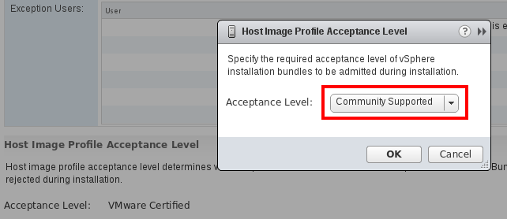
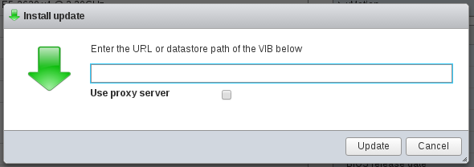
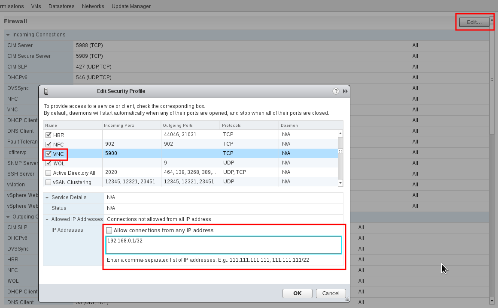

.. _vcenter_node:

================================================================================
vCenter Node Installation
================================================================================

This guide lays out the configuration requirements needed in the vCenter and ESX instances in order to be managed by OpenNebula.

The VMware vCenter drivers enable OpenNebula to access one or more vCenter servers managing one or more ESX Clusters. Each ESX Cluster is presented in OpenNebula as an aggregated hypervisor, i.e. as an OpenNebula Host. This means that the representation is one OpenNebula Host per ESX Cluster.

Note that OpenNebula scheduling decisions are therefore made at ESX Cluster level. vCenter then uses the DRS component to select the actual ESX Host and Datastore to deploy the Virtual Machine.

Requirements
================================================================================

* Supported vSphere version (check :ref:`Platform Notes <vcenter_nodes_platform_notes>`).
* vCenter user for OpenNebula, the hassle-free approach is to declare this oneadmin user as an administrator. Otherwise, a table with the permissions required is found at the :ref:`end of this guide <vcenter_permissions_requirement>`.
* If virtual standard switches are used, check that those switches exist in every ESX Host belonging to the same ESX cluster. Conversely, if you use distributed virtual switches, check that ESX Hosts have been added to switches.
* We recommend using FireEdge to enable VMRC. However, you can also use :ref:`VNC to access your vCenter VMs <vnc_one_esx_hosts>`. :VNC functionality requires that the Front-end has network connectivity to all the ESX Hosts.
* Although optional, the ESX cluster should have DRS enabled. OpenNebula does not schedule to the granularity of ESX Hosts, so DRS is needed to select the actual ESX Host within the cluster.

It's worth highlighting that OpenNebula will not modify any vCenter configuration with some exceptions: the creation of virtual switches and port groups if the vcenter network driver is used, and the creation of images for VMDK and/or ISO files.

For security reasons, you may define different users to access different ESX clusters. A different user can be defined in OpenNebula per ESX cluster, which is encapsulated in OpenNebula as an OpenNebula Host.

.. warning:: OpenNebula uses port 443 to communicate with vCenter instances. Port 443 is the default port used by vCenter, so unless you're filtering that port, or you've configured a different port to listen for connections from the vSphere Web Client, OpenNebula will be able to connect with the right credentials.

Configuration
================================================================================

Step 1: Configure the Drivers in the Front-end (oned.conf)
--------------------------------------------------------------------------------

.. _vcenter_import_host_tool:

Step 2: Importing vCenter Clusters
--------------------------------------------------------------------------------

OpenNebula ships with a powerful CLI tool to import vCenter clusters, VM Templates, Networks and running VMs. The tool **onevcenter** is self-explanatory, just set the credentials and FQDN/IP to access the vCenter Host and follow on screen instructions.

If you need to know how to import vCenter clusters, check :ref:`vCenter import tool <vcenter_import_clusters>`.

After importing a vCenter cluster as an OpenNebula Host, it should be successfully monitored. If the OpenNebula Host goes into ERROR state, please check connectivity and have a look at the ``/var/log/one/oned.log`` file in order to find out the possible cause.

The following variables are added to OpenNebula Hosts representing ESX clusters:

+---------------------+------------------------------------+
|    Operation        |                Note                |
+---------------------+------------------------------------+
| VCENTER_HOST        | Hostname or IP of the vCenter Host |
+---------------------+------------------------------------+
| VCENTER_USER        | Name of the vCenter user           |
+---------------------+------------------------------------+
| VCENTER_PASSWORD    | Password of the vCenter user       |
+---------------------+------------------------------------+
| VCENTER_VERSION     | The vCenter version detected by    |
|                     | OpenNebula e.g 5.5                 |
+---------------------+------------------------------------+
| VCENTER_CCR_REF     | The Managed Object Reference to    |
|                     | the vCenter cluster                |
+---------------------+------------------------------------+
| VCENTER_INSTANCE_ID | The vCenter instance UUID          |
|                     | identifier                         |
+---------------------+------------------------------------+

You have more information about what a Managed Object Reference is and what the vCenter instance UUID is in the :ref:`vCenter driver<vcenter_managed_object_reference>` section.

.. note::

   OpenNebula will create a special key at boot time and save it in ``/var/lib/one/.one/one_key``. This key will be used as a private key to encrypt and decrypt all the passwords for all the vCenters that OpenNebula can access. Thus, the password shown in the OpenNebula Host representing the vCenter is the original password encrypted with this special key.

Step 3: Next Steps
--------------------------------------------------------------------------------

Now, you can continue with:

- :ref:`VMware Storage Setup <vmware_storage_setup>`,
- :ref:`VMware Networking Setup <vmware_networking_setup>`

to additionally configure, extend and control your cloud.

.. _vnc_one_esx_hosts:

VNC on ESX Hosts [Optional]
================================================================================

The default OpenNebula installation comes with the FireEdge component which enables VMRC access to vCenter VMs from Sunstone. However, VNC can be used to access these VMs if FireEdge is not configured in Sunstone.

To enable VNC functionality, you need to allow access to the VNC ports on ESX Hosts. By default, access to these ports is filtered by the firewall. We provide an installation package, which adds the **VNC** ruleset (port range 5900-11999 excluding known reserved ports) and permits access to these ports. Also, OpenNebula needs to be reconfigured to respect this specific VNC ports range. This package must be installed on each ESX Host; it can be done via CLI or web UI. We'll cover the necessary steps for both ways here.

Locations of the VIB installation package or ZIP bundle:

* On your OpenNebula Front-end server, in ``/usr/share/one/esx-fw-vnc/``.
  Installed as part of the package

  * **opennebula-server** on RHEL/CentOS
  * **opennebula** on Debian and Ubuntu.

* On the public download server. In a case of installation problems,
  insecure HTTP access can be used at your own risk!

  * https://downloads.opennebula.io/packages/opennebula-6.1.80/fw-vnc-6.1.80.vib
  * https://downloads.opennebula.io/packages/opennebula-6.1.80/fw-vnc-6.1.80.zip

.. note::

   Make sure that the ESX Hosts are reachable from the OpenNebula Front-end.

The VNC range whitelisted on ESX Hosts must be specified in the OpenNebula configuration located in ``/etc/one/oned.conf``. Please change the ``VNC_PORTS`` section in the following way:

.. code::

    VNC_PORTS = [
        START    = 5900,
        RESERVED = "5988:5989, 6999, 8000, 8042:8045, 8080, 8100, 8182, 8200, 8300:8302, 8889, 9000, 9080, 12000:65535"
    ]

and restart OpenNebula:

.. prompt:: bash $ auto

    $ sudo systemctl restart opennebula

Using CLI
---------

.. note::

    Please replace the placeholder variables ``$ESX_HOST`` (ESX hostname),
    ``$ESX_USER`` (access username) and ``$ESX_PSWD`` (access user's password)
    with the valid access parameters depending on your infrastructure configuration.

**Over SSH**

If you have enabled direct SSH access on the ESX Hosts, copy the VIB installation
packages to the ESX Host via scp. Log in to the ESX Host via SSH, allow the community
packages to be installed and do the install.

.. note::

    The absolute path to the VIB must be provided.

.. prompt:: bash $ auto

    $ scp /usr/share/one/esx-fw-vnc/fw-vnc.* $ESX_HOST:/tmp/
    $ ssh $ESX_HOST
    $ esxcli software acceptance set --level=CommunitySupported
    $ esxcli software vib install -v /tmp/fw-vnc.vib

This enables VNC ports for any remote Host. You should
limit access to the VNC only from your OpenNebula Front-end. In this example, we restrict access from all IP addresses except 192.168.0.1

.. prompt:: bash $ auto

    $ esxcli network firewall ruleset set --ruleset-id VNC --allowed-all false
    $ esxcli network firewall ruleset allowedip add --ruleset-id VNC --ip-address 192.168.0.1/32
    $ esxcli network firewall ruleset allowedip list --ruleset-id VNC

Repeat for each ESX Host.

**VMware vSphere CLI**

If you have a working VMware vSphere CLI, you can install the package
remotely via ``esxcli``.

First, check the CLI is working:

.. prompt:: bash $ auto

    $ esxcli --server $ESX_HOST --username $ESX_USER --password $ESX_PSWD system version get

If the connection fails on untrusted fingerprint, please specify the valid
one as an extra ``esxcli`` parameter ``--thumbprint``. Example:

.. prompt:: bash $ auto

    $ esxcli --server $ESX_HOST --username $ESX_USER --password $ESX_PSWD system version get
    Connect to $ESX_HOST failed. Server SHA-1 thumbprint: 00:11:22:33:...:11:22:33 (not trusted).
    $ esxcli --server $ESX_HOST --username $ESX_USER --password $ESX_PSWD --thumbprint '00:11:22:33:...:11:22:33' system version get
      Product: VMware ESXi
      Version: 6.5.0
      Build: Releasebuild-4887370
      Update: 0
      Patch: 9

Now, with all required connection parameters from the test above, use the ``esxcli``
to allow the community packages to be installed and proceed with the install.

.. note::

    VIB must be accessible from the ESX Host, as an absolute file path
    on the ESX Host or downloadable URL.

.. prompt:: bash $ auto

    $ esxcli <connection options> software acceptance set --level=CommunitySupported
    $ esxcli <connection options> software vib install -v 'https://downloads.opennebula.io/packages/opennebula-6.1.80/fw-vnc-6.1.80.vib'

This enables VNC ports for any remote Host. You should
limit access to the VNC only from your OpenNebula Front-end. In this example, we restrict access from all IP addresses except 192.168.0.1.

.. prompt:: bash $ auto

    $ esxcli <connection options> network firewall ruleset set --ruleset-id VNC --allowed-all false
    $ esxcli <connection options> network firewall ruleset allowedip add --ruleset-id VNC --ip-address 192.168.0.1/32
    $ esxcli <connection options> network firewall ruleset allowedip list --ruleset-id VNC

Repeat for each ESX Host.

Using UI
--------

The VIB package can also be installed over vSphere and ESX web UIs.

* Allow the custom VIB package to be installed (in the vSphere client)

  * Log in to the vSphere client
  * Go to Home -> Inventories -> Hosts and Clusters
  * Select the ESX Host and its tab **Manage** or **Configure** (depends on the vSphere version)
  * Select **Security Profile** in the **System category**
  * At the very bottom, select edit on **Host Image Profile Acceptance Level**
  * Switch to **Community Supported** and confirm with **OK**

* Install the VIB package (in the ESX Host UI)

  * Log in to the ESX Host UI
  * Go to Help -> Update in top right corner
  * Provide the VIB URL or absolute local path and click on **Update**

* Restrict VNC access to the OpenNebula Front-end only (in the vSphere client)

  * Go back again to the ESX Host details in the vSphere client
  * Reload the vSphere page to see current data
  * Check again **Security Profile** in the **System category**, look on the Firewall/Incoming Connections for new **VNC** item
  * Click on **Edit** for the Firewall
  * Find the VNC and optionally restrict access only to your OpenNebula Front-end (e.g. for 192.168.0.1):

Repeat for each ESX Host.

.. _vcenter_permissions_requirement:

Permissions requirement
================================================================================

If the user account that is going to be used in vCenter operations is not declared as an Administrator, the following table summarizes the privileges required by the tasks performed in vCenter by OpenNebula:

+---------------------------------------------+-----------------------------------------+----------------------------------------------------------------------------+
|                Privileges ID                |              Privilege name             |                                   Notes                                    |
+---------------------------------------------+-----------------------------------------+----------------------------------------------------------------------------+
| Datastore.AllocateSpace                     | Allocate space                          | On all VMFS datastores represented by OpenNebula                           |
+---------------------------------------------+-----------------------------------------+----------------------------------------------------------------------------+
| Datastore.Browse                            | Browse datastore                        | On all VMFS datastores represented by OpenNebula                           |
+---------------------------------------------+-----------------------------------------+----------------------------------------------------------------------------+
| Datastore.FileManagement                    | Low level file operations               | On all VMFS datastores represented by OpenNebula                           |
+---------------------------------------------+-----------------------------------------+----------------------------------------------------------------------------+
| Datastore.Delete                            | Remove datastore                        | On all VMFS datastores represented by OpenNebula                           |
+---------------------------------------------+-----------------------------------------+----------------------------------------------------------------------------+
| DVPortgroup.Create                          | Create                                  | Required if you want OpenNebula to create distributed port groups          |
+---------------------------------------------+-----------------------------------------+----------------------------------------------------------------------------+
| DVPortgroup.Delete                          | Delete                                  | Required if you want OpenNebula to destroy a distributed port group that   |
|                                             |                                         | was previously created by OpenNebula.                                      |
+---------------------------------------------+-----------------------------------------+----------------------------------------------------------------------------+
| DVPortgroup.Modify                          | Modify                                  | Required if you want OpenNebula to create distributed port groups          |
+---------------------------------------------+-----------------------------------------+----------------------------------------------------------------------------+
| DVSwitch.Create                             | Create                                  | Required if you want OpenNebula to create distributed virtual switches     |
+---------------------------------------------+-----------------------------------------+----------------------------------------------------------------------------+
| DVSwitch.Delete                             | Delete                                  | Required if you want OpenNebula to destroy a distributed virtual switches  |
|                                             |                                         | that was previously created by OpenNebula.                                 |
+---------------------------------------------+-----------------------------------------+----------------------------------------------------------------------------+
| DVSwitch.HostOp                             | Host operation                          | Required if you want OpenNebula to create distributed virtual switches     |
+---------------------------------------------+-----------------------------------------+----------------------------------------------------------------------------+
| DVSwitch.Modify                             | Modify                                  | Required if you want OpenNebula to create distributed virtual switches     |
+---------------------------------------------+-----------------------------------------+----------------------------------------------------------------------------+
| DVSwitch.PortSetting                        | Port setting operation                  | Required if you want OpenNebula to create distributed virtual switches     |
+---------------------------------------------+-----------------------------------------+----------------------------------------------------------------------------+
| Host.Config.Network                         | Network configuration                   | Required on all **ESX Hosts** where you want OpenNebula to create, update  |
|                                             |                                         | or delete virtual switches and port groups                                 |
+---------------------------------------------+-----------------------------------------+----------------------------------------------------------------------------+
| Network.Assign                              | Assign network                          | Required on any network the Virtual Machine will be connected to           |
+---------------------------------------------+-----------------------------------------+----------------------------------------------------------------------------+
| Resource.ApplyRecommendation                | Apply recommendation                    | On all Storage Pods (Storage DRS cluster) represented by OpenNebula        |
+---------------------------------------------+-----------------------------------------+----------------------------------------------------------------------------+
| Resource.AssignVMToPool                     | Assign Virtual Machine to resource pool | Required to assign a resource pool to a Virtual Machine                    |
+---------------------------------------------+-----------------------------------------+----------------------------------------------------------------------------+
| Resource.ColdMigrate                        | Migrate powered off Virtual Machine     | Required to migrate powered off Virtual Machine                            |
+---------------------------------------------+-----------------------------------------+----------------------------------------------------------------------------+
| Resource.HotMigrate                         | Migrate powered on Virtual Machine      | Required to migrate powered on Virtual Machine                             |
+---------------------------------------------+-----------------------------------------+----------------------------------------------------------------------------+
| System.Read                                 | Read                                    | Required to rename Uplink port group for a distributed switch only if you  |
|                                             |                                         | want OpenNebula to create distributed virtual switches.                    |
+---------------------------------------------+-----------------------------------------+----------------------------------------------------------------------------+
| VirtualMachine.Config.AddExistingDisk       | Add existing disk                       | Required to browse for and attach an existing virtual disk                 |
+---------------------------------------------+-----------------------------------------+----------------------------------------------------------------------------+
| VirtualMachine.Config.AddNewDisk            | Add new disk                            | Required to create and attach a new virtual disk                           |
+---------------------------------------------+-----------------------------------------+----------------------------------------------------------------------------+
| VirtualMachine.Config.AddRemoveDevice       | Add or remove device                    | Required to add or remove virtual devices                                  |
+---------------------------------------------+-----------------------------------------+----------------------------------------------------------------------------+
| VirtualMachine.Config.AdvancedConfig        | Advanced                                | Required to make advanced configuration changes                            |
+---------------------------------------------+-----------------------------------------+----------------------------------------------------------------------------+
| VirtualMachine.Config.Annotation            | Set annotation                          | Required to set annotation on a Virtual Machine                            |
+---------------------------------------------+-----------------------------------------+----------------------------------------------------------------------------+
| VirtualMachine.Config.ChangeTracking        | Disk change tracking                    | Required to enable or disable change tracking for the                      |
|                                             |                                         | Virtual Machine's disks                                                    |
+---------------------------------------------+-----------------------------------------+----------------------------------------------------------------------------+
| VirtualMachine.Config.CPUCount              | Change CPU count                        | Required to change the number of virtual CPUs                              |
+---------------------------------------------+-----------------------------------------+----------------------------------------------------------------------------+
| VirtualMachine.Config.DiskExtend            | Extend virtual disk                     | Required to extend virtual disk                                            |
+---------------------------------------------+-----------------------------------------+----------------------------------------------------------------------------+
| VirtualMachine.Config.HostUSBDevice         | Host USB device                         | Required to add, remove or edit a virtual USB device backed by             |
|                                             |                                         | a Host USB device                                                          |
+---------------------------------------------+-----------------------------------------+----------------------------------------------------------------------------+
| VirtualMachine.Config.Memory                | Memory                                  | Required to set the amount of Virtual Machine memory                       |
+---------------------------------------------+-----------------------------------------+----------------------------------------------------------------------------+
| VirtualMachine.Config.RawDevice             | Raw device                              | Required for Virtual Machine raw device configuration                      |
+---------------------------------------------+-----------------------------------------+----------------------------------------------------------------------------+
| VirtualMachine.Config.RemoveDisk            | Remove disk                             | Required to detach and optionally remove a virtual disk                    |
+---------------------------------------------+-----------------------------------------+----------------------------------------------------------------------------+
| VirtualMachine.Config.Rename                | Rename                                  | Required to rename a Virtual Machine                                       |
+---------------------------------------------+-----------------------------------------+----------------------------------------------------------------------------+
| VirtualMachine.Config.Settings              | Settings                                | Required to change Virtual Machine settings                                |
+---------------------------------------------+-----------------------------------------+----------------------------------------------------------------------------+
| VirtualMachine.Config.SwapPlacement         | Swapfile placement                      | Required to set the placement policy for single Virtual Machine's swapfile |
+---------------------------------------------+-----------------------------------------+----------------------------------------------------------------------------+
| VirtualMachine.Interact.DeviceConnection    | Device connection                       | Required to connect/disconnect media and network devices                   |
+---------------------------------------------+-----------------------------------------+----------------------------------------------------------------------------+
| VirtualMachine.Interact.PowerOff            | Power Off                               | Required to power off or shutdown a Virtual Machine                        |
+---------------------------------------------+-----------------------------------------+----------------------------------------------------------------------------+
| VirtualMachine.Interact.PowerOn             | Power On                                | Required to power on or resume a Virtual Machine                           |
+---------------------------------------------+-----------------------------------------+----------------------------------------------------------------------------+
| VirtualMachine.Interact.Reset               | Reset                                   | Reset (power cycle) a Virtual Machine                                      |
+---------------------------------------------+-----------------------------------------+----------------------------------------------------------------------------+
| VirtualMachine.Interact.SetCDMedia          | Configure CD media                      | Configure a different media for virtual CD-ROMs                            |
+---------------------------------------------+-----------------------------------------+----------------------------------------------------------------------------+
| VirtualMachine.Interact.SetFloppyMedia      | Configure floppy media                  | Required to configure a different floppy media                             |
+---------------------------------------------+-----------------------------------------+----------------------------------------------------------------------------+
| VirtualMachine.Interact.Suspend             | Suspend                                 | Required to suspend a Virtual Machine                                      |
+---------------------------------------------+-----------------------------------------+----------------------------------------------------------------------------+
| VirtualMachine.Inventory.Create             | Create new                              | Required to create a new Virtual Machine or template                       |
+---------------------------------------------+-----------------------------------------+----------------------------------------------------------------------------+
| VirtualMachine.Inventory.CreateFromExisting | Create from existing                    | Required to create a Virtual Machine based on an existing virtual machine  |
|                                             |                                         | or template                                                                |
+---------------------------------------------+-----------------------------------------+----------------------------------------------------------------------------+
| VirtualMachine.Inventory.Delete             | Remove                                  | Required to remove a Virtual Machine                                       |
+---------------------------------------------+-----------------------------------------+----------------------------------------------------------------------------+
| VirtualMachine.Inventory.Move               | Move                                    | Required to move a Virtual Machine                                         |
+---------------------------------------------+-----------------------------------------+----------------------------------------------------------------------------+
| VirtualMachine.Inventory.Register           | Register                                | Required to add an existing Virtual Machine to the inventory               |
+---------------------------------------------+-----------------------------------------+----------------------------------------------------------------------------+
| VirtualMachine.Inventory.Unregister         | Unregister                              | Required to unregister a Virtual Machine                                   |
+---------------------------------------------+-----------------------------------------+----------------------------------------------------------------------------+
| VirtualMachine.Provisioning.CloneTemplate   | Clone template                          | Required to clone a template                                               |
+---------------------------------------------+-----------------------------------------+----------------------------------------------------------------------------+
| VirtualMachine.Provisioning.DeployTemplate  | Deploy template                         | Required to deploy a Virtual Machine from a particular template            |
+---------------------------------------------+-----------------------------------------+----------------------------------------------------------------------------+
| VirtualMachine.Provisioning.ReadCustSpecs   | Read customization specifications       | Required to read customization specifications                              |
+---------------------------------------------+-----------------------------------------+----------------------------------------------------------------------------+
| VirtualMachine.State.CreateSnapshot         | Create snapshot                         | Required to create a new snapshot of a Virtual Machine.                    |
+---------------------------------------------+-----------------------------------------+----------------------------------------------------------------------------+
| VirtualMachine.State.RemoveSnapshot         | Remove snapshot                         | Required to remove snapshots from a Virtual Machine                        |
+---------------------------------------------+-----------------------------------------+----------------------------------------------------------------------------+
| VirtualMachine.State.RevertToSnapshot       | Revert to snapshot                      | Required to revert a Virtual Machine to a particular snapshot              |
+---------------------------------------------+-----------------------------------------+----------------------------------------------------------------------------+

Special Permission
------------------

The above permissions, except one, can be set at the cluster level. However, OpenNebula needs access to the customization spec for successful monitoring. This is a special privilege because it needs to be applied to the vCenter server level. It means that if you try to apply the previous privileges to a cluster/datacenter and their inheritors, OpenNebula will fail and it will tell you that higher level permissions are necessary.

Our recommended approach is to create two roles, one for the general permissions ("opennebulapermissions") that can be applied in the cluster level, and another to handle this single permission. This way, you can create a role for managing all OpenNebula permissions and another role (called, for instance, readcustspec) with **only** the following role:

+---------------------------------------------+---------------------------------------------+----------------------------------------------------------------------------+
|               Privileges ID                 |             Privilege name                  |                       Notes                                                |
+---------------------------------------------+---------------------------------------------+----------------------------------------------------------------------------+
| VirtualMachine.Provisioning.ReadCustSpecs   | Read customization specifications           | Required to read customization specifications                              |
+---------------------------------------------+---------------------------------------------+----------------------------------------------------------------------------+

Once you have created the proper role, one way to manage these privileges is by creating two groups.

  - The first group needs to be assigned the **readcustspec** role. Place the OpenNebula user inside this group and grant permission over the vCenter instance to the group.
  - The second groups needs to be assigned the **opennebulapermissions** role. Place the OpenNebula user inside this group and grant permission over the desired cluster to the group.

.. note::
    Do not forget to add the proper permissions to the datastores and any resource accessed by your OpenNebula user.
